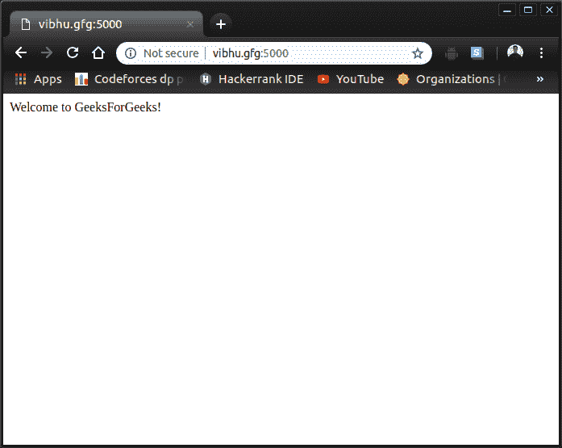
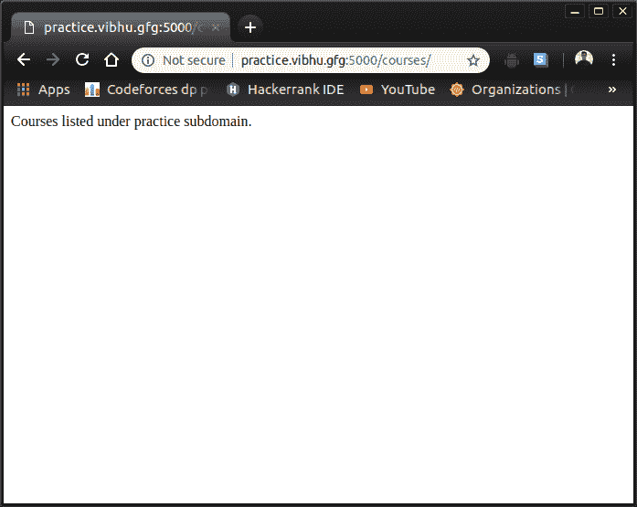

# 烧瓶中的子域| Python

> 原文:[https://www.geeksforgeeks.org/subdomain-in-flask-python/](https://www.geeksforgeeks.org/subdomain-in-flask-python/)

先决条件:[烧瓶简介](https://www.geeksforgeeks.org/python-introduction-to-web-development-using-flask/)

在本文中，我们将学习如何在 Flask 中设置子域。但是首先，让我们来看一下基本的，比如什么是域名系统和子域。

**域名系统(DNS):**
域名系统(DNS)是一个分级和分散的命名系统，用于连接到互联网或专用网络的计算机、服务或其他资源。最突出的是，它将更容易记忆的域名转换为数字 IP 地址，这些地址是定位和识别具有底层网络协议的计算机服务和设备所需要的。
域名系统基本上是用单词(域名)代替数字(IP 地址)来定位某物。例如`127.0.0.1`用于指向本地计算机地址， *localhost* 。

**子域:**
子域是更大域的一部分。基本上，它是一种子域，这意味着它是某个父域的一部分。例如，`practice.geeksforgeeks.org`和`contribute.geeksforgeeks.org`是`geeksforgeeks.org`域的子域，而这个子域又是`org`顶级域(TLD)的子域。
这些与`geeksforgeeks.org/basic/`中 TLD 之后定义的路径不同。

此外，我们将讨论如何使用 Python 的微框架 Flask 在 web 应用程序中设置端点。

**为本地 IP 添加备用域名–**
在编码部分之前，我们需要设置*主机*文件，以便为本地 IP 提供备用域名，这样我们就可以在本地测试我们的应用程序。以 root 权限编辑此文件。

```py
Linux: /etc/hosts 
Windows: C:\Windows\System32\Drivers\etc\hosts
```

添加这些行来设置备用域名。

```py
127.0.0.1       vibhu.gfg
127.0.0.1       practice.vibhu.gfg
```

在这个例子中，我们考虑`vibhu.gfg`作为我们的域名，其中`gfg`是 TLD。`practice`将是我们在网络应用中设定的一个子域。

**设置服务器–**
在应用的配置中`SERVER_NAME`被设置为域名，以及我们打算运行应用的端口号。烧瓶使用的默认端口是`5000`，所以我们就这样吧。

```py
from flask import Flask

app = Flask(__name__)

@app.route('/')
def home():
    return "Welcome to GeeksForGeeks !"

if __name__ == "__main__":
    website_url = 'vibhu.gfg:5000'
    app.config['SERVER_NAME'] = website_url
    app.run()
```

**输出:**
运行应用，注意应用运行的链接。

在浏览器上测试链接。


**添加几个端点–**

1.  **基本:**主域路径的扩展端点。
2.  **实践:**服务于`practice`子域的端点。
3.  **课程:**延伸到练习子域路径上的端点。

使用`app.route`装饰器中的`subdomain`参数设置烧瓶中的子域。

```py
from flask import Flask

app = Flask(__name__)

@app.route('/')
def home():
    return "Welcome to GeeksForGeeks !"

@app.route('/basic/')
def basic():
    return "Basic Category Articles " \
           "listed on this page."

@app.route('/', subdomain ='practice')
def practice():
    return "Coding Practice Page"

@app.route('/courses/', subdomain ='practice')
def courses():
    return "Courses listed " \
           "under practice subdomain."

if __name__ == "__main__":
    website_url = 'vibhu.gfg:5000'
    app.config['SERVER_NAME'] = website_url
    app.run()
```

**输出:**
