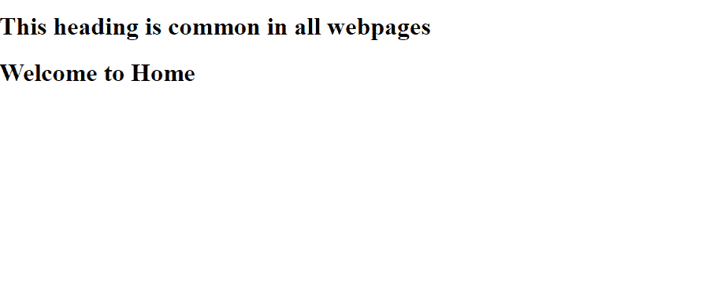

# 烧瓶中的模板继承

> 原文:[https://www . geesforgeks . org/template-瓶内继承/](https://www.geeksforgeeks.org/template-inheritance-in-flask/)

T 模板继承是金佳模板的一个很好的特点。Jinja 是 Python 编程语言的网络模板引擎。我们已经看到一个网站的网页包含相同的页脚，导航栏等。因此，我们没有在所有网页中分别制作相同的页脚和导航栏，而是使用模板继承，这允许我们只创建一次在所有网页中相同的部分(例如页脚、导航栏)，并且我们也不需要一次又一次地编写 html、head、title 标记。让我们在 base.html 文件中定义网页的通用结构。首先，我们将使用 main.py 文件中的 flask 渲染模板。

**<u>先决条件</u>**–[烧瓶–(创建第一个简单应用程序)](https://www.geeksforgeeks.org/flask-creating-first-simple-application/)

**步骤 1–**创建一个烧瓶应用程序来渲染主模板

## 蟒蛇 3

```py
from flask import Flask, render_template

# Setting up the application
app = Flask(__name__)

# making route

@app.route('/')
def home():
    return render_template('home.html')

# running application
if __name__ == '__main__':
    app.run(debug=True)
```

**第 2 步**–创建 HTML 文件

现在，我们将建立我们的 base.html 文件，其中我们有一个标题，这将是所有网页中常见的。

**语法:**

```py


```

这些行上面和下面的代码对于每个网页都是相同的，它们之间的代码对于特定的网页也是相同的。

## 超文本标记语言

```py
<!DOCTYPE html>
<html lang="en">
<head>
    <title>Template Inheritance</title>
</head>
<body>
    <h1> This heading is common in all webpages </h1>
    
    

</body>
</html>
```

现在我们将建立我们的 base.html 文件，我们将从“base.html”文件继承模板，并将为它编写一些代码

主页也是。

**语法:**

```py
  
        
          write code here for home page only 
        
```

## 超文本标记语言

```py



<h1>Welcome to Home</h1>


```

运行主. py 文件。

**输出–**

下面是输出。

[](https://media.geeksforgeeks.org/wp-content/uploads/20200726134831/Capture.PNG)

本文只是一个简单的例子。我们还可以添加导航栏，页脚等到 base.html 文件，并可以继承到 home.html 文件和许多其他文件。