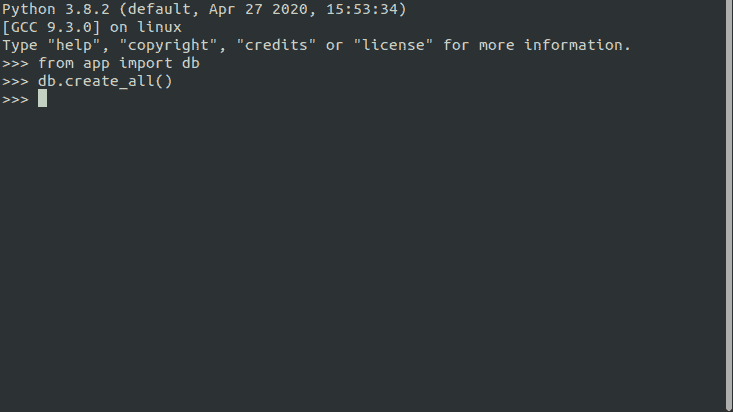
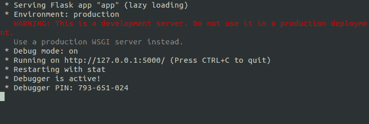
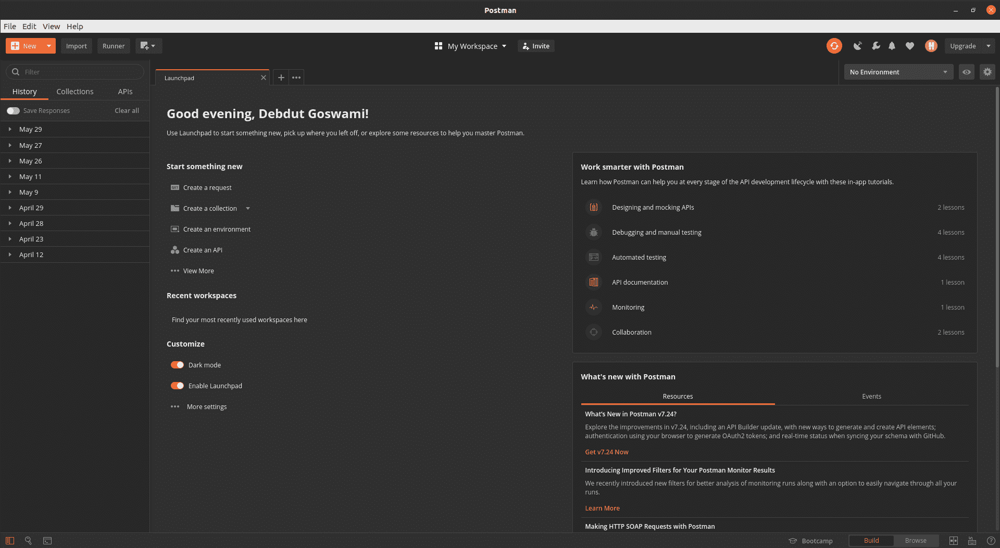
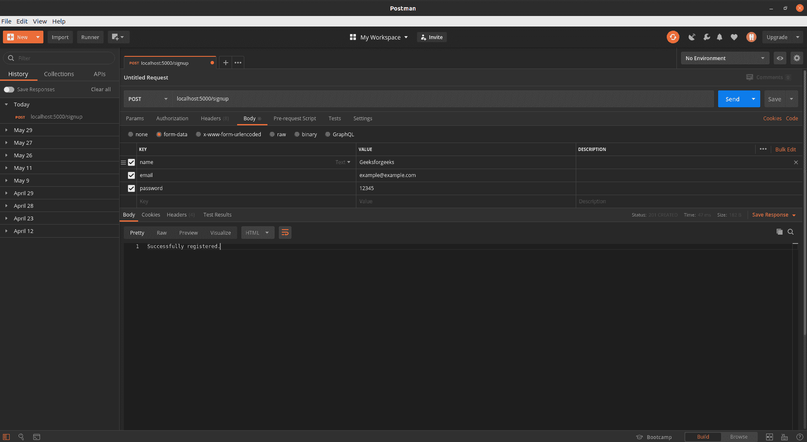
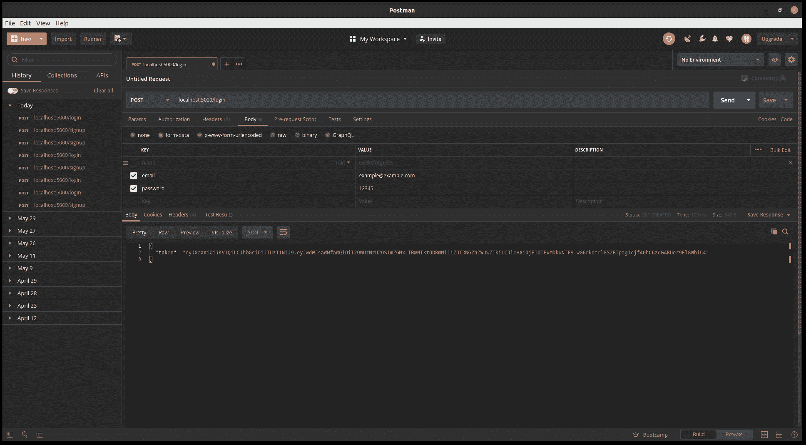
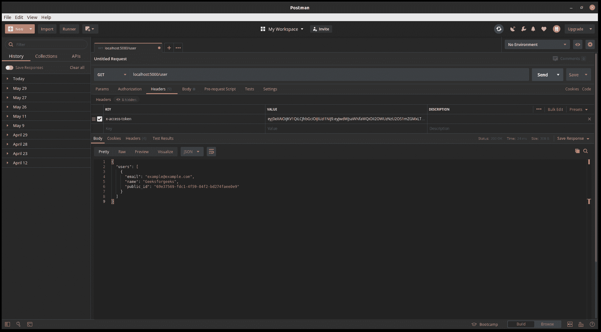

# 在烧瓶中使用 JWT 进行用户认证

> 原文:[https://www . geesforgeks . org/using-jwt-for-user-authentication-in-flask/](https://www.geeksforgeeks.org/using-jwt-for-user-authentication-in-flask/)

**先决条件:**关于 [JSON 网络令牌(JWT)](https://www.geeksforgeeks.org/json-web-token-jwt/)
的基本知识我将假设你对 JWT 和 JWT 的工作原理有基本的了解。如果没有，那么我建议阅读链接的 Geeksforgeeks 文章。

让我们直接进入设置。当然，你需要在你的系统上安装 **python3** 。现在，跟我来。我将使用一个**虚拟环境**，在那里我将安装库，这无疑是进行任何开发的最佳方式。

*   首先创建一个名为**烧瓶项目**的文件夹，并将目录更改为该文件夹。如果你在 linux 上，那么在你的终端中输入以下内容。

```
mkdir "flask project" && cd "flask project"
```

*   现在，创建一个虚拟环境。如果你在 linux 上，那么在你的终端中输入以下内容。

```
python3 -m venv env
```

**注意:**如果您出现任何错误，则意味着您的系统中没有安装 **venv** 。要安装它，在你的终端中输入 *sudo apt 安装 python3-venv* ，然后你就可以开始了。如果你在 windows 上，那么使用类似 *virtualenv* 的东西来创建一个虚拟环境。

这将在**烧瓶项目**中创建一个名为 **venv** 的文件夹，其中将包含项目特定的库。

*   现在创建一个名为 *requirements.txt* 的文件，并在其中添加以下几行。

```
Flask-RESTful==0.3.8
PyJWT==1.7.1
Flask-SQLAlchemy==2.4.1
```

*   现在，让我们为这个项目安装这些库。为此，首先我们需要激活虚拟环境。为此，请在您的终端中键入以下内容。

```
source env/bin/activate
```

**注意:**如果你在 windows 上，那么应该是*脚本*而不是 *bin*
现在，是时候安装库了。为此，再次在您的终端中键入以下内容。

```
pip install -r requirements.txt
```

现在，我们完成了设置部分。现在让我们开始编写实际的代码。在开始讲代码之前，我想说清楚一些事情。我会将整个代码写在一个文件中，也就是说，将数据库模型和路由放在一起，这不是一个好的做法，对于大型项目来说肯定是不可管理的。尝试为路线和数据库模型创建单独的 python 文件或模块。
清除后，让我们直接进入编写实际代码。我将添加内联注释来解释代码的每一部分。

创建一个名为 *app.py* 的 python 文件，并在其中键入以下代码。

## 蟒蛇 3

```
# flask imports
from flask import Flask, request, jsonify, make_response
from flask_sqlalchemy import SQLAlchemy
import uuid # for public id
from  werkzeug.security import generate_password_hash, check_password_hash
# imports for PyJWT authentication
import jwt
from datetime import datetime, timedelta
from functools import wraps

# creates Flask object
app = Flask(__name__)
# configuration
# NEVER HARDCODE YOUR CONFIGURATION IN YOUR CODE
# INSTEAD CREATE A .env FILE AND STORE IN IT
app.config['SECRET_KEY'] = 'your secret key'
# database name
app.config['SQLALCHEMY_DATABASE_URI'] = 'sqlite:///Database.db'
app.config['SQLALCHEMY_TRACK_MODIFICATIONS'] = True
# creates SQLALCHEMY object
db = SQLAlchemy(app)

# Database ORMs
class User(db.Model):
    id = db.Column(db.Integer, primary_key = True)
    public_id = db.Column(db.String(50), unique = True)
    name = db.Column(db.String(100))
    email = db.Column(db.String(70), unique = True)
    password = db.Column(db.String(80))

# decorator for verifying the JWT
def token_required(f):
    @wraps(f)
    def decorated(*args, **kwargs):
        token = None
        # jwt is passed in the request header
        if 'x-access-token' in request.headers:
            token = request.headers['x-access-token']
        # return 401 if token is not passed
        if not token:
            return jsonify({'message' : 'Token is missing !!'}), 401

        try:
            # decoding the payload to fetch the stored details
            data = jwt.decode(token, app.config['SECRET_KEY'])
            current_user = User.query\
                .filter_by(public_id = data['public_id'])\
                .first()
        except:
            return jsonify({
                'message' : 'Token is invalid !!'
            }), 401
        # returns the current logged in users contex to the routes
        return  f(current_user, *args, **kwargs)

    return decorated

# User Database Route
# this route sends back list of users users
@app.route('/user', methods =['GET'])
@token_required
def get_all_users(current_user):
    # querying the database
    # for all the entries in it
    users = User.query.all()
    # converting the query objects
    # to list of jsons
    output = []
    for user in users:
        # appending the user data json
        # to the response list
        output.append({
            'public_id': user.public_id,
            'name' : user.name,
            'email' : user.email
        })

    return jsonify({'users': output})

# route for logging user in
@app.route('/login', methods =['POST'])
def login():
    # creates dictionary of form data
    auth = request.form

    if not auth or not auth.get('email') or not auth.get('password'):
        # returns 401 if any email or / and password is missing
        return make_response(
            'Could not verify',
            401,
            {'WWW-Authenticate' : 'Basic realm ="Login required !!"'}
        )

    user = User.query\
        .filter_by(email = auth.get('email'))\
        .first()

    if not user:
        # returns 401 if user does not exist
        return make_response(
            'Could not verify',
            401,
            {'WWW-Authenticate' : 'Basic realm ="User does not exist !!"'}
        )

    if check_password_hash(user.password, auth.get('password')):
        # generates the JWT Token
        token = jwt.encode({
            'public_id': user.public_id,
            'exp' : datetime.utcnow() + timedelta(minutes = 30)
        }, app.config['SECRET_KEY'])

        return make_response(jsonify({'token' : token.decode('UTF-8')}), 201)
    # returns 403 if password is wrong
    return make_response(
        'Could not verify',
        403,
        {'WWW-Authenticate' : 'Basic realm ="Wrong Password !!"'}
    )

# signup route
@app.route('/signup', methods =['POST'])
def signup():
    # creates a dictionary of the form data
    data = request.form

    # gets name, email and password
    name, email = data.get('name'), data.get('email')
    password = data.get('password')

    # checking for existing user
    user = User.query\
        .filter_by(email = email)\
        .first()
    if not user:
        # database ORM object
        user = User(
            public_id = str(uuid.uuid4()),
            name = name,
            email = email,
            password = generate_password_hash(password)
        )
        # insert user
        db.session.add(user)
        db.session.commit()

        return make_response('Successfully registered.', 201)
    else:
        # returns 202 if user already exists
        return make_response('User already exists. Please Log in.', 202)

if __name__ == "__main__":
    # setting debug to True enables hot reload
    # and also provides a debuger shell
    # if you hit an error while running the server
    app.run(debug = True)
```

现在，我们的代码准备好了。我们现在需要首先创建数据库，然后从 ORM(对象关系映射)创建表*用户*。为此，首先在您的终端中启动 python3 解释器。你可以通过在你的终端中输入 *python3* 来做到这一点，这应该对你有用。

接下来，您需要在 python3 解释器中键入以下内容:

```
from app import db
db.create_all()
```

因此，它首先导入数据库对象，然后调用 *create_all()* 函数从 ORM 创建所有表。应该是这样的。



现在我们的实际代码已经准备好了，让我们测试一下。我推荐使用[邮递员](https://www.postman.com/)来测试 API。你可以使用像 CURL 这样的东西，但是我将在本教程中使用 postman。

要开始测试我们的 api，首先我们需要运行我们的 API。为此，请打开一个终端窗口，并在其中键入以下内容。

```
python app.py
```

您应该会看到这样的输出



如果你有任何错误，那么确保你所有的语法和缩进都是正确的。可以看到我们的 api 运行在 [http://localhost:5000/](http://localhost:5000/) 上。复制此网址。我们将使用这个 URL 和路由来测试 api。
现在，打开*邮差*。你应该对下面的屏幕感到满意。



现在，点击 **+** 号，输入网址*本地主机:5000/注册*将请求类型更改为*邮政*，然后选择*正文*，然后选择*表单-数据*，输入数据为键值对，然后点击*发送*，您应该会得到响应。应该是这样的。



所以，我们注册了。现在让我们登录。为此，只需将端点更改为*/登录*，并取消勾选*名称*字段，然后点击*发送*。你应该得到一个 JWT 作为回应。记下 JWT。这将是我们的令牌，我们需要将该令牌与每个后续请求一起发送。该令牌将识别我们已登录。



JSON 包含令牌。记下来。接下来尝试获取用户列表。为此，将端点更改为*/用户*，然后在标题部分，添加一个字段作为 *x-access-token* ，并在值中添加 JWT token，然后单击*发送*。您将获得用户列表作为 JSON。



这就是在 Flask 中使用 JWT 进行身份验证的方法。我建议你多练习 JWTs 和用户认证，让你的概念更加清晰。