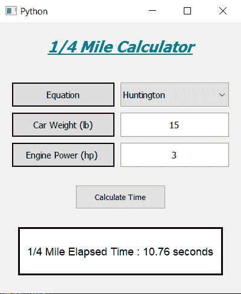

# Python 中使用 PyQt5 的 1/4 英里计算器

> 原文:[https://www . geeksforgeeks . org/1-4 英里计算器-使用 python 中的-pyqt5/](https://www.geeksforgeeks.org/1-4-mile-calculator-using-pyqt5-in-python/)

**先决条件:**[pyqt-5 简介](https://www.geeksforgeeks.org/python-introduction-to-pyqt5/)

在本文中，我们将看到如何使用 **PyQt5** 创建四分之一(1/4)英里计算器。*四分之一英里计算器*用于根据车辆的重量和功率确定车辆的终端速度(陷阱速度)和四分之一英里行驶时间(ET)。

下图显示了 1/4 英里计算器的外观:



1/4 英里计算器

**四分之一英里**计算器采用三个不同的经验公式来确定四分之一英里经过时间(ET)。具体如下:****

****1。罗杰·亨廷顿方程:****

```
Time = 6.290 × (Weight / Power)^(1/3)
```

****2。杰弗里·福克斯方程:****

```
Time = 6.269 × (Weight / Power)^(1/3)
```

****3。帕特里克·黑尔方程:****

```
Time = 5.825 × (Weight / Power)^(1/3)
```

****注:**这里重量以磅(lb)为单位，功率以马力(hp)为单位。** 

> ****GUI 实现步骤:**
> **1。**创建显示计算器名称
> **2 的标题标签**。创建标签并梳理** o 框对以选择方程，标签显示用户要选择的内容，组合框选择
> **3。**同样创建一对标签和线编辑得到汽车的重量和功率
> **4。**创建一个按钮来计算时间
> **5。**创建一个标签来显示计算的时间****

> ****后端实现:**
> **1** 。使组合框不可编辑
> **2。**使行编辑只接受数字作为输入
> **3。**向按钮
> **4 添加动作。**内侧按钮动作获取该行编辑的文本
> **5。**检查行编辑文本是空的还是零的，然后返回，这样功能就不会再执行了
> **6。**将文本值转换为整数
> **7** 。从组合框中获取选择的选项，并根据它设置常量
> **8。**计算时间，并通过标签
> 显示该值**

**下面是实现:** 

## **蟒蛇 3**

```
# importing required libraries
from PyQt5.QtWidgets import *
from PyQt5 import QtCore, QtGui
from PyQt5.QtGui import *
from PyQt5.QtCore import *

import sys

class Window(QMainWindow):

    def __init__(self):
        super().__init__()

        # setting title
        self.setWindowTitle("Python ")

        # width of window
        self.w_width = 400

        # height of window
        self.w_height = 450

        # setting geometry
        self.setGeometry(100, 100, 
                         self.w_width, 
                         self.w_height)

        # calling method
        self.UiComponents()

        # showing all the widgets
        self.show()

    # method for components
    def UiComponents(self):

        # creating head label
        head = QLabel("1/4 Mile Calculator", 
                      self)

        # setting geometry to the head
        head.setGeometry(0, 10, 400, 60)

        # setting font
        font = QFont('Times', 15)
        font.setBold(True)
        font.setItalic(True)
        font.setUnderline(True)

        # setting font to the head
        head.setFont(font)

        # setting alignment of the head
        head.setAlignment(Qt.AlignCenter)

        # setting color effect to the head
        color = QGraphicsColorizeEffect(self)
        color.setColor(Qt.darkCyan)
        head.setGraphicsEffect(color)

        # creating a label
        e_label = QLabel("Equation", self)

        # setting properties  label
        e_label.setAlignment(Qt.AlignCenter)
        e_label.setGeometry(20, 100, 170, 40)
        e_label.setStyleSheet("QLabel"
                              "{"
                              "border : 2px solid black;"
                              "background : rgba(70, 70, 70, 35);"
                              "}")
        e_label.setFont(QFont('Times', 9))

        # creating a combo box to selected equation
        self.equation = QComboBox(self)

        # adding items to the combo box
        items = ["Huntington", "Fox", "Hale"]
        self.equation.addItems(items)

        # setting properties to the combo box
        self.equation.setFont(QFont('Times', 9))
        self.equation.setGeometry(200, 100, 180, 40)
        self.equation.setEditable(False)

        # creating a label
        w_label = QLabel("Car Weight (lb)", self)

        # setting properties to the label
        w_label.setAlignment(Qt.AlignCenter)
        w_label.setGeometry(20, 150, 170, 40)
        w_label.setStyleSheet("QLabel"
                              "{"
                              "border : 2px solid black;"
                              "background : rgba(70, 70, 70, 35);"
                              "}")
        w_label.setFont(QFont('Times', 9))

        # creating a QLineEdit object
        self.weight = QLineEdit(self)

        # accepting only number as input
        onlyInt = QIntValidator()
        self.weight.setValidator(onlyInt)

        # setting properties to the line edit
        self.weight.setGeometry(200, 150, 180, 40)
        self.weight.setAlignment(Qt.AlignCenter)
        self.weight.setFont(QFont('Times', 9))

        # creating a label
        p_label = QLabel("Engine Power (hp) ", self)

        # setting properties to the years label
        p_label.setAlignment(Qt.AlignCenter)
        p_label.setGeometry(20, 200, 170, 40)
        p_label.setStyleSheet("QLabel"
                              "{"
                              "border : 2px solid black;"
                              "background : rgba(70, 70, 70, 35);"
                              "}")
        p_label.setFont(QFont('Times', 9))

        # creating a QLineEdit object
        self.power = QLineEdit(self)

        # accepting only number as input
        onlyInt = QIntValidator()
        self.power.setValidator(onlyInt)

        # setting properties to the line edit
        self.power.setGeometry(200, 200, 180, 40)
        self.power.setAlignment(Qt.AlignCenter)
        self.power.setFont(QFont('Times', 9))

        # creating a push button
        calculate = QPushButton("Calculate Time", self)

        # setting geometry to the push button
        calculate.setGeometry(125, 270, 150, 40)

        # adding action to the calculate button
        calculate.clicked.connect(self.calculate_action)

        # creating a label to show percentile
        self.result = QLabel(self)

        # setting properties to result label
        self.result.setAlignment(Qt.AlignCenter)
        self.result.setGeometry(30, 340, 340, 80)
        self.result.setWordWrap(True)
        self.result.setStyleSheet("QLabel"
                                  "{"
                                  "border : 3px solid black;"
                                  "background : white;"
                                  "}")
        self.result.setFont(QFont('Arial', 11))

    # method for calculating the 
    # quarter-mile elapsed time (ET)
    def calculate_action(self):

        # getting weight of car
        weight = self.weight.text()

        # getting power of engine
        power = self.power.text()

        # if no input is given close the function
        if len(weight) == 0 or len(power) == 0:
            return

        # converting weight into integer
        weight = int(weight)

        # converting power into integer
        power = int(power)

        # if user enter total value as 0
        # return the function
        if power == 0 or weight == 0:
            return

        # getting the selected equation index
        equation = self.equation.currentIndex()

        # setting constant value according to the equation
        # Roger Huntington's constant
        if equation == 0:
            constant = 6.290

        # Geoffrey Fox's constant
        elif equation == 1:
            constant = 6.269

        # Patrick Hale's constant
        else:
            constant = 5.825

        # calculating the time
        result = constant * ((weight/power)**(1/3))

        # formatting the time
        result = "{:.2f}".format(result)

        # setting text to the result label
        self.result.setText("1/4 Mile Elapsed Time : "
                            + str(result) + " seconds")

# create pyqt5 app
App = QApplication(sys.argv)

# create the instance of our Window
window = Window()

# start the app
sys.exit(App.exec())
```

****输出:**** 

**<video class="wp-video-shortcode" id="video-435659-1" width="640" height="360" preload="metadata" controls=""><source type="video/mp4" src="https://media.geeksforgeeks.org/wp-content/uploads/20200615021746/Python-2020-06-15-02-16-52.mp4?_=1">[https://media.geeksforgeeks.org/wp-content/uploads/20200615021746/Python-2020-06-15-02-16-52.mp4](https://media.geeksforgeeks.org/wp-content/uploads/20200615021746/Python-2020-06-15-02-16-52.mp4)</video>**