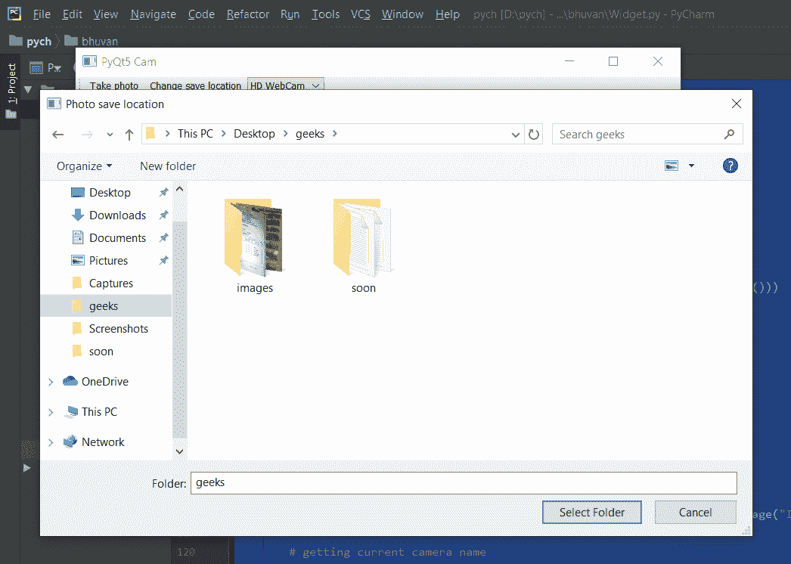
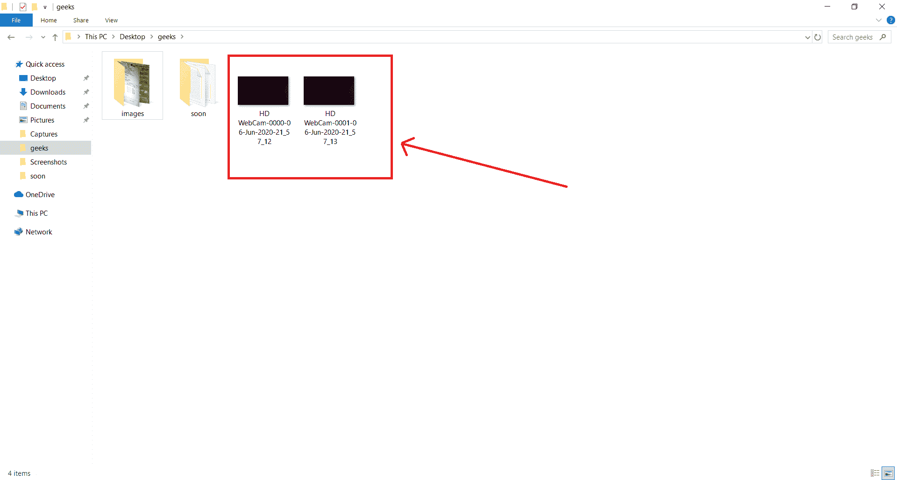

# 使用 Pyqt5 创建相机应用程序

> 原文:[https://www . geeksforgeeks . org/creating-a-camera-application-use-pyqt 5/](https://www.geeksforgeeks.org/creating-a-camera-application-using-pyqt5/)

**先决条件:**[pyqt-5 简介](https://www.geeksforgeeks.org/python-introduction-to-pyqt5/)

**PyQt5** 是一个跨平台的 GUI 工具包，一套针对 Qt v5 的 python 绑定。由于该库提供的工具和简单性，人们可以非常容易地开发交互式桌面应用程序。

在本文中，我们将看到如何使用 **PyQt5** 创建一个简单的相机应用程序，它将捕获图像并将它们保存在可以随时更改的所需位置。

## GUI 实现步骤:

> 1.  Create the main window.
> 2.  Add the QCameraViewfinder object as a central widget to the main window.
> 3.  Add a status bar in the window to give a status prompt.
> 4.  Add the toolbar to the window.
> 5.  Add click and change position actions to the toolbar, and a combo box for selecting cameras. The following figure is what the toolbar looks like.


## 后端实施步骤:

> 1.  Create a path variable and set it to blank at present.
> 2.  Add the available cameras to the combo box and set the first camera as the default.
> 3.  Add an action to the "Take a picture" button.
> 4.  Within the click action, the photos of the given path are captured with the name as the time stamp, and the count is incremented.
> 5.  Add an action to the change position button.
> 6.  In the action of changing position, open the dialog box to get the path and update the path and counter.
> 7.  Add an action to the combo box.
> 8.  In the combo box, the block action gets the selected camera, and sets the framing and shooting mode for it.
> 9.  Create an alarm method, and if there is any error when selecting the path and changing the camera, an error message will be displayed.

下面是实现:

## 蟒蛇 3

```py
# importing required libraries
from PyQt5.QtWidgets import *
from PyQt5.QtMultimedia import *
from PyQt5.QtMultimediaWidgets import *
import os
import sys
import time

# Main window class
class MainWindow(QMainWindow):

    # constructor
    def __init__(self):
        super().__init__()

        # setting geometry
        self.setGeometry(100, 100,
                         800, 600)

        # setting style sheet
        self.setStyleSheet("background : lightgrey;")

        # getting available cameras
        self.available_cameras = QCameraInfo.availableCameras()

        # if no camera found
        if not self.available_cameras:
            # exit the code
            sys.exit()

        # creating a status bar
        self.status = QStatusBar()

        # setting style sheet to the status bar
        self.status.setStyleSheet("background : white;")

        # adding status bar to the main window
        self.setStatusBar(self.status)

        # path to save
        self.save_path = ""

        # creating a QCameraViewfinder object
        self.viewfinder = QCameraViewfinder()

        # showing this viewfinder
        self.viewfinder.show()

        # making it central widget of main window
        self.setCentralWidget(self.viewfinder)

        # Set the default camera.
        self.select_camera(0)

        # creating a tool bar
        toolbar = QToolBar("Camera Tool Bar")

        # adding tool bar to main window
        self.addToolBar(toolbar)

        # creating a photo action to take photo
        click_action = QAction("Click photo", self)

        # adding status tip to the photo action
        click_action.setStatusTip("This will capture picture")

        # adding tool tip
        click_action.setToolTip("Capture picture")

        # adding action to it
        # calling take_photo method
        click_action.triggered.connect(self.click_photo)

        # adding this to the tool bar
        toolbar.addAction(click_action)

        # similarly creating action for changing save folder
        change_folder_action = QAction("Change save location",
                                       self)

        # adding status tip
        change_folder_action.setStatusTip("Change folder where picture will be saved saved.")

        # adding tool tip to it
        change_folder_action.setToolTip("Change save location")

        # setting calling method to the change folder action
        # when triggered signal is emitted
        change_folder_action.triggered.connect(self.change_folder)

        # adding this to the tool bar
        toolbar.addAction(change_folder_action)

        # creating a combo box for selecting camera
        camera_selector = QComboBox()

        # adding status tip to it
        camera_selector.setStatusTip("Choose camera to take pictures")

        # adding tool tip to it
        camera_selector.setToolTip("Select Camera")
        camera_selector.setToolTipDuration(2500)

        # adding items to the combo box
        camera_selector.addItems([camera.description()
                                  for camera in self.available_cameras])

        # adding action to the combo box
        # calling the select camera method
        camera_selector.currentIndexChanged.connect(self.select_camera)

        # adding this to tool bar
        toolbar.addWidget(camera_selector)

        # setting tool bar stylesheet
        toolbar.setStyleSheet("background : white;")

        # setting window title
        self.setWindowTitle("PyQt5 Cam")

        # showing the main window
        self.show()

    # method to select camera
    def select_camera(self, i):

        # getting the selected camera
        self.camera = QCamera(self.available_cameras[i])

        # setting view finder to the camera
        self.camera.setViewfinder(self.viewfinder)

        # setting capture mode to the camera
        self.camera.setCaptureMode(QCamera.CaptureStillImage)

        # if any error occur show the alert
        self.camera.error.connect(lambda: self.alert(self.camera.errorString()))

        # start the camera
        self.camera.start()

        # creating a QCameraImageCapture object
        self.capture = QCameraImageCapture(self.camera)

        # showing alert if error occur
        self.capture.error.connect(lambda error_msg, error,
                                   msg: self.alert(msg))

        # when image captured showing message
        self.capture.imageCaptured.connect(lambda d,
                                           i: self.status.showMessage("Image captured : " 
                                                                      + str(self.save_seq)))

        # getting current camera name
        self.current_camera_name = self.available_cameras[i].description()

        # inital save sequence
        self.save_seq = 0

    # method to take photo
    def click_photo(self):

        # time stamp
        timestamp = time.strftime("%d-%b-%Y-%H_%M_%S")

        # capture the image and save it on the save path
        self.capture.capture(os.path.join(self.save_path, 
                                          "%s-%04d-%s.jpg" % (
            self.current_camera_name,
            self.save_seq,
            timestamp
        )))

        # increment the sequence
        self.save_seq += 1

    # change folder method
    def change_folder(self):

        # open the dialog to select path
        path = QFileDialog.getExistingDirectory(self, 
                                                "Picture Location", "")

        # if path is selected
        if path:

            # update the path
            self.save_path = path

            # update the sequence
            self.save_seq = 0

    # method for alerts
    def alert(self, msg):

        # error message
        error = QErrorMessage(self)

        # setting text to the error message
        error.showMessage(msg)

# Driver code
if __name__ == "__main__" :

  # create pyqt5 app
  App = QApplication(sys.argv)

  # create the instance of our Window
  window = MainWindow()

  # start the app
  sys.exit(App.exec())
```

**输出:**
当我们点击更改位置时，这个对话框会出现



让我们去这个文件夹看看图像是否被捕获

