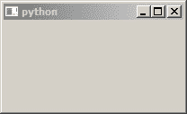
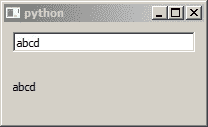

# 在 PyQt5 中创建自定义小部件

> 原文:[https://www . geesforgeks . org/creating-custom-widgets-in-pyqt 5/](https://www.geeksforgeeks.org/creating-custom-widgets-in-pyqt5/)

[PyQt5](https://www.geeksforgeeks.org/python-introduction-to-pyqt5/) 是 Python 最高级的 GUI 库之一。虽然功能强大，但它的结构也很好，便于您构建“高级”项目。PyQt5 中的定制小部件轻而易举。

下面描述了用 PyQt5 构建定制小部件的一种很好的方式，

**主窗口**
让我们从创建主窗口开始。我们从一开始就走面向对象的路线。无面向对象的方式对于维护来说是一种痛苦。我们的骨架是这样的

```
import sys

from PyQt5 import QtWidgets
from PyQt5 import QtCore
from PyQt5 import QtGui

class MainWindow(QtWidgets.QMainWindow):
    def __init__(self, parent = None):
        super().__init__(parent)
        self.init_gui()

    def init_gui(self):
        self.window = QtWidgets.QWidget()
        self.layout = QtWidgets.QGridLayout()
        self.setCentralWidget(self.window)
        self.window.setLayout(self.layout)

if __name__ == '__main__':
    app = QtWidgets.QApplication([])

    win = MainWindow()
    win.show()

    sys.exit(app.exec_())
```

哪些输出到



**正常应用程序**

让我们添加一个文本框和一个标签，无论我们键入什么，它都会产生回声。
我们的主窗口转向这个:

```
class MainWindow(QtWidgets.QMainWindow):
    def __init__(self, parent = None):
        super().__init__(parent)
        self.init_gui()

    def init_gui(self):
        self.window = QtWidgets.QWidget()
        self.layout = QtWidgets.QGridLayout()
        self.setCentralWidget(self.window)
        self.window.setLayout(self.layout)

        self.textbox = QtWidgets.QLineEdit()
        self.echo_label = QtWidgets.QLabel('')

        self.textbox.textChanged.connect(self.textbox_text_changed)

        self.layout.addWidget(self.textbox, 0, 0)
        self.layout.addWidget(self.echo_label, 1, 0)

    def textbox_text_changed(self):
        self.echo_label.setText(self.textbox.text())
```

哪些输出到



**小部件骨架**

一个空的小部件如下所示:

```
class MyWidget(QtWidgets.QWidget):

    def __init__(self, *args, **kwargs):
        super().__init__(*args, **kwargs)
        self.layout = QtWidgets.QGridLayout()
        self.setLayout(self.layout)
```

让我们将其命名为回声文本，并将我们添加的内容添加到主窗口中

```
class EchoText(QtWidgets.QWidget):

    def __init__(self, *args, **kwargs):
        super().__init__(*args, **kwargs)
        self.layout = QtWidgets.QGridLayout()
        self.setLayout(self.layout)

        self.textbox = QtWidgets.QLineEdit()
        self.echo_label = QtWidgets.QLabel('')

        self.textbox.textChanged.connect(self.textbox_text_changed)

        self.layout.addWidget(self.textbox, 0, 0)
        self.layout.addWidget(self.echo_label, 1, 0)

    def textbox_text_changed(self):
        self.echo_label.setText(self.textbox.text())
```

**像普通小部件一样使用**

在我们的主窗口中，只保留骨架并添加以下内容:

```
self.echotext_widget = EchoText()

self.layout.addWidget(self.echotext_widget)
```

当我们在主窗口中编码时，它会显示出来。

**完整的应用程序**

这是整个应用程序的完整代码

```
import sys

from PyQt5 import QtWidgets
from PyQt5 import QtCore
from PyQt5 import QtGui

class EchoText(QtWidgets.QWidget):

    def __init__(self, *args, **kwargs):
        super().__init__(*args, **kwargs)
        self.layout = QtWidgets.QGridLayout()
        self.setLayout(self.layout)

        self.textbox = QtWidgets.QLineEdit()
        self.echo_label = QtWidgets.QLabel('')

        self.textbox.textChanged.connect(self.textbox_text_changed)

        self.layout.addWidget(self.textbox, 0, 0)
        self.layout.addWidget(self.echo_label, 1, 0)

    def textbox_text_changed(self):
        self.echo_label.setText(self.textbox.text())

class MainWindow(QtWidgets.QMainWindow):

    def __init__(self, parent = None):
        super().__init__(parent)
        self.init_gui()

    def init_gui(self):
        self.window = QtWidgets.QWidget()
        self.layout = QtWidgets.QGridLayout()
        self.setCentralWidget(self.window)
        self.window.setLayout(self.layout)

        self.echotext_widget = EchoText()

        self.layout.addWidget(self.echotext_widget)

if __name__ == '__main__':
    app = QtWidgets.QApplication([])

    win = MainWindow()
    win.show()

    sys.exit(app.exec_())
```

尝试创建一个不同的小部件并添加它。PyQt5 听起来比 Tkinter 更难上手，但值得！