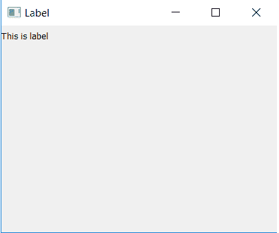

# 如何在 PyQt5 中创建 Label 小部件？

> 原文:[https://www . geeksforgeeks . org/如何创建标签-widget-in-pyqt5/](https://www.geeksforgeeks.org/how-to-create-label-widget-in-pyqt5/)

在设计任何图形用户界面时，都需要在屏幕上显示纯文本，为此*标签小部件*在 PyQt5 中使用。

一个**标签**是一个在表单上显示文本的图形控制元素。它通常是静态控件；没有交互性。标签通常用于标识附近的文本框或其他小部件。有些标签可以响应鼠标点击等事件，允许复制标签的文本，但这不是标准的用户界面实践。

要在 PyQt5 中使用标签，我们必须从`PyQt5.QtWidgets` 导入`QLabel`，下面是这样做的语法。

```
from PyQt5.QtWidgets import QLabel
```

导入`Qlabel`后，我们可以在 PyQt5 应用程序中创建标签。

**语法:**

```
self.label_name = QLabel(Info, self)
```

这里`Info`可以是任何字符串类型的文本。

下面是 Python 实现–

```
# importing the required libraries

from PyQt5.QtWidgets import QLabel
from PyQt5.QtWidgets import QMainWindow
from PyQt5.QtWidgets import QApplication
import sys

class Window(QMainWindow):
    def __init__(self):
        super().__init__()

        # set the title
        self.setWindowTitle("Label")

        # setting  the geometry of window
        self.setGeometry(0, 0, 400, 300)

        # creating a label widget
        # by default label will display at top left corner
        self.label = QLabel('This is label', self)

        # show all the widgets
        self.show()

# create pyqt5 app
App = QApplication(sys.argv)

# create the instance of our Window
window = Window()

# start the app
sys.exit(App.exec())
```

**输出:**
