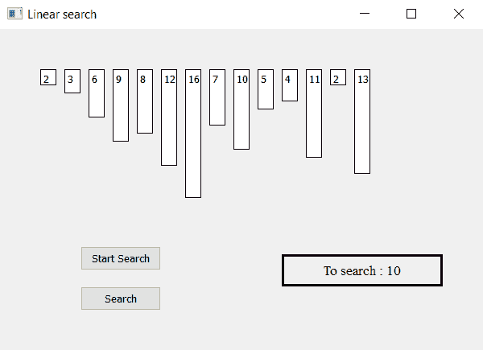

# 使用 PyQt5 的线性搜索可视化工具

> 原文:[https://www . geesforgeks . org/linear-search-visualizer-using-pyqt 5/](https://www.geeksforgeeks.org/linear-search-visualizer-using-pyqt5/)

在本文中，我们将看到如何制作一个 PyQt5 应用程序，它将可视化[线性搜索](https://www.geeksforgeeks.org/linear-search/)算法。

线性搜索或顺序搜索是一种在列表中查找元素的方法。它依次检查列表中的每个元素，直到找到匹配项或搜索了整个列表。


> **Gui 实现步骤:**
> 
> 1.根据给定的数字列表
> 2 创建标签列表。将它们的文字、边框、颜色和几何形状设置为彼此之间有相应的间隙
> 3。每个标签高度应与每个数字的值成比例
> 4。创建开始和暂停按钮，开始搜索并暂停搜索
> 5。创建结果标签以显示搜索状态
> 
> **后端实现步骤:**
> 1。创建对应于给定编号的标签列表
> 2。创建一个变量来计算搜索的索引和标志
> 3。向按钮添加动作他们的动作应该改变标志状态，即开始动作应该使标志为真，暂停动作应该使标志为假
> 4。创建一个定时器对象，它在每个特定时间后调用一个方法
> 5。定时器方法内部检查标志是否为真标志开始线性搜索算法
> 6。如果标签值不相等，使其颜色为灰色，然后检查下一个，如果找到值，使标签颜色为绿色，停止搜索，并在结果标签中显示输出。
> 7。如果索引计数器等于列表长度，则停止搜索，并将结果显示为未找到。

下面是实现

```
# importing libraries
from PyQt5.QtWidgets import * 
from PyQt5 import QtCore, QtGui
from PyQt5.QtGui import * 
from PyQt5.QtCore import * 
import sys

class Window(QMainWindow):

    # list of numbers
    number = [2, 3, 6, 9, 8, 12, 16, 7, 10, 5, 4, 11, 2, 13]
    def __init__(self):
        super().__init__()

        # setting title
        self.setWindowTitle("Linear search ")

        # setting geometry
        self.setGeometry(100, 100, 600, 400)

        # calling method
        self.UiComponents()

        # showing all the widgets
        self.show()

    # method for widgets
    def UiComponents(self):

        # start flag
        self.start = False

        # list to hold labels
        self.label_list = []

        # desired value
        self.desired = 11

        # counter for keeping index
        self.counter = 0

        # local counter
        c = 0

        # iterating list of numbers
        for i in self.number:

            # creating label for each number
            label = QLabel(str(i), self)

            # adding background color and border
            label.setStyleSheet("border : 1px solid black;
                                 background : white;")

            # aligning the text
            label.setAlignment(Qt.AlignTop)

            # setting geometry using local counter
            # first parameter is distance from left 
            # and second is distance from top
            # third is width and forth is height
            label.setGeometry(50 + c * 30, 50, 20, i * 10 + 10)

            # adding label to the label list
            self.label_list.append(label)

            # incrementing local counter
            c = c + 1

        # creating push button to start the search
        self.search_button = QPushButton("Start Search", self)

        # setting geometry of the button
        self.search_button.setGeometry(100, 270, 100, 30)

        # adding action to the search button
        self.search_button.clicked.connect(self.search_action)

        # creating push button to pause the search
        pause_button = QPushButton("Pause", self)

        # setting geometry of the button
        pause_button.setGeometry(100, 320, 100, 30)

        # adding action to the search button
        pause_button.clicked.connect(self.pause_action)

        # creating label to show the result
        self.result = QLabel("To search : " + str(self.desired), self)

        # setting geometry
        self.result.setGeometry(350, 280, 200, 40)

        # setting style sheet
        self.result.setStyleSheet("border : 3px solid black;")

        # adding font
        self.result.setFont(QFont('Times', 10))

        # setting alignment
        self.result.setAlignment(Qt.AlignCenter)

        # creating a timer object
        timer = QTimer(self)

        # adding action to timer
        timer.timeout.connect(self.showTime)

        # update the timer every 200 millisecond
        timer.start(200)

    # method called by timer
    def showTime(self):

        # checking if flag is true
        if self.start:
            # linear search

            # checking if the element is equal to desired element
            if self.label_list[self.counter].text() == str(self.desired):

                # make its color green
                self.label_list[self.counter].setStyleSheet(
                                  "border : 1px solid black; 
                                   background : lightgreen;")

                # show result in result label
                self.result.setText("Found at index : "
                                     + str(self.counter))

                # make the start flag false
                self.start = False

                # reseting the counter
                self.counter = 0

            # if element is not equal
            else:

                # make the label color grey
                self.label_list[self.counter].setStyleSheet(
                                  "border : 1px solid black;
                                   background : grey;")

            # increment the counter
            self.counter += 1

            # if counter value become equal to list length
            if self.counter == len(self.label_list):

                # make start flag false
                self.start = False

                # show result i.e not found
                self.result.setText("Not Found")

    # method called by search button
    def search_action(self):

        # making flag true
        self.start = True

        # showing text in result label
        self.result.setText("Started searching...")

    # method called by pause button
    def pause_action(self):

        # making flag false
        self.start = False

        # showing text in result label
        self.result.setText("Paused")

# create pyqt5 app
App = QApplication(sys.argv)

# create the instance of our Window
window = Window()

# start the app
sys.exit(App.exec())
```

**输出:**

<video class="wp-video-shortcode" id="video-406341-1" width="640" height="428" preload="metadata" controls=""><source type="video/mp4" src="https://media.geeksforgeeks.org/wp-content/uploads/20200420151821/Linear-search-20-04-2020-15_15_50.mp4?_=1">[https://media.geeksforgeeks.org/wp-content/uploads/20200420151821/Linear-search-20-04-2020-15_15_50.mp4](https://media.geeksforgeeks.org/wp-content/uploads/20200420151821/Linear-search-20-04-2020-15_15_50.mp4)</video>