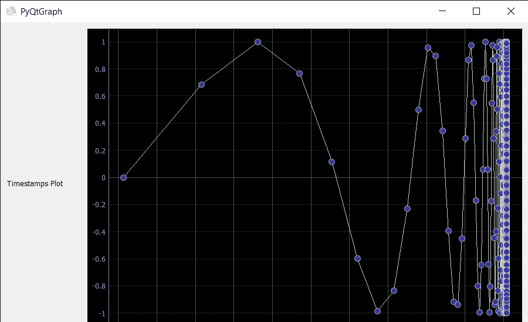

# 使用 PyQtGraph 绘制带有时间戳的数据

> 原文:[https://www . geeksforgeeks . org/绘图-带时间戳的数据-使用-pyqtgraph/](https://www.geeksforgeeks.org/plotting-data-with-timestamps-using-pyqtgraph/)

在本文中，我们将看到如何使用 Python 中的 PyQtGraph 模块绘制带有时间戳的数据。PyQtGraph 是 Python 的图形和用户界面库，提供设计和科学应用程序通常需要的功能。它的主要目标是为显示数据(图表、视频等)提供快速的交互式图形。)第二个是提供工具来帮助快速应用程序开发(例如，属性树，如在 Qt Designer 中使用的属性树)。

为了安装 PyQtGraph，我们使用下面给出的命令。

```py
pip install pyqtgraph
```

时间戳是一系列字符或编码信息，用于识别某个事件发生的时间，通常给出日期和时间，有时精确到几分之一秒。在本教程中，我们将看到如何在 x 轴和 y 轴上绘制时间戳，y 轴会有相应的数据。

为了做到这一点，我们必须做到以下几点

1.  导入所需的库，如 pyqtgraph、pyqt5、time 和 numpy
2.  使用 pyqt5 创建一个主窗口类
3.  创建一个图形窗口，将 axisitem 设置为时间戳的 DateAxisItem
4.  现在创建一个数据来绘制在这个例子中，我们将绘制过去 100 年中带有时间戳的 sin(1/x^2
5.  用这些数据绘制线图
6.  将图形和其他小部件添加到主窗口的中央小部件布局中。

下面是实现。

## 蟒蛇 3

```py
# importing Qt widgets
from PyQt5.QtWidgets import *

# importing system
import sys

# time module
import time
from datetime import datetime, timedelta

# importing numpy as np
import numpy as np

# importing pyqtgraph as pg
import pyqtgraph as pg
from PyQt5.QtGui import *
from PyQt5.QtCore import *

class Window(QMainWindow):

    def __init__(self):
        super().__init__()

        # setting title
        self.setWindowTitle("PyQtGraph")

        # setting geometry
        self.setGeometry(100, 100, 900, 550)

        # icon
        icon = QIcon("skin.png")

        # setting icon to the window
        self.setWindowIcon(icon)

        # calling method
        self.UiComponents()

        # showing all the widgets
        self.show()

    # method for components
    def UiComponents(self):

        # creating a widget object
        widget = QWidget()

        # text
        text = "Timestamps Plot"

        # creating a label
        label = QLabel(text)

        # setting minimum width
        label.setMinimumWidth(130)

        # making label do word wrap
        label.setWordWrap(True)

        # Create a plot with a date-time axis (timestamps on x-axis)
        w = pg.PlotWidget(axisItems={'bottom': pg.DateAxisItem()})

        # show the grids  on the graph
        w.showGrid(x=True, y=True)

        # Plotting sin(1/x^2) with timestamps in the last 100 years
        now = time.time()

        # x data
        x = np.linspace(2 * np.pi, 1000 * 2 * np.pi, 8301)

        # plot the data
        w.plot(now - (2 * np.pi / x) ** 2 * 100 *
               np.pi * 1e7, np.sin(x), symbol='o')

        # Creating a grid layout
        layout = QGridLayout()

        # minimum width value of the label
        label.setMinimumWidth(130)

        # setting this layout to the widget
        widget.setLayout(layout)

        # adding label in the layout
        layout.addWidget(label, 1, 0)

        # plot window goes on right side, spanning 3 rows
        layout.addWidget(w, 0, 1, 3, 1)

        # setting this widget as central widget of the main window
        self.setCentralWidget(widget)

# create pyqt5 app
App = QApplication(sys.argv)

# create the instance of our Window
window = Window()

# start the app
sys.exit(App.exec())
```

**输出:**

