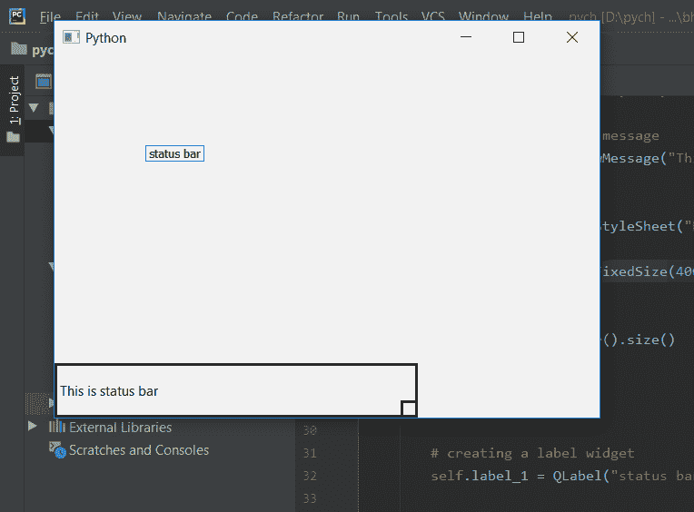

# PyQt5–访问状态栏的大小

> 原文:[https://www . geeksforgeeks . org/pyqt 5-访问大小状态栏/](https://www.geeksforgeeks.org/pyqt5-access-the-size-of-status-bar/)

在本文中，我们将看到如何访问状态栏的大小。我们知道，我们可以使用带有状态栏对象的`setFizedSize`方法来设置状态栏大小，为了访问状态栏大小，我们将使用带有其对象的`**size**`方法。

> **注意:**
> **- >** 如果没有设置状态栏的大小，它将返回最小大小。
> **- >** 如果状态栏设置了固定大小，它将返回固定大小。
> **- >** 如果设置了状态栏的最小尺寸，它将返回最小尺寸。
> **- >** 如果设置了状态栏的最大尺寸，它将返回最小尺寸。

```py
Syntax : self.statusBar().size()

Argument : It takes no argument.

Return : It returns QSize object.
```

**代码:**

```py
from PyQt5.QtCore import * 
from PyQt5.QtGui import * 
from PyQt5.QtWidgets import * 
import sys

class Window(QMainWindow):
    def __init__(self):
        super().__init__()

        # set the title
        self.setWindowTitle("Python")

        # setting  the geometry of window
        self.setGeometry(60, 60, 600, 400)

        # setting status bar message
        self.statusBar().showMessage("This is status bar")

        # setting  border
        self.statusBar().setStyleSheet("border :3px solid black;")

        # setting fixed size
        self.statusBar().setFixedSize(400, 60)

        # getting size
        size = self.statusBar().size()

        # printing the size
        print(size)

        # creating a label widget
        self.label_1 = QLabel("status bar", self)

        # moving position
        self.label_1.move(100, 100)

        # setting up the border
        self.label_1.setStyleSheet("border :1px solid blue;")

        # resizing label
        self.label_1.adjustSize()

        # show all the widgets
        self.show()

# create pyqt5 app
App = QApplication(sys.argv)

# create the instance of our Window
window = Window()

# start the app
sys.exit(App.exec())
```

**输出:**

```py
PyQt5.QtCore.QSize(400, 60)
```

