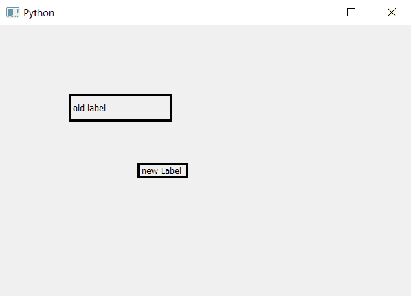

# PyQt5–访问标签的大小

> 原文:[https://www . geesforgeks . org/pyqt 5-访问标签大小/](https://www.geeksforgeeks.org/pyqt5-access-the-size-of-the-label/)

我们可以使用`resize()`方法设置标签的大小，并且可以使用`adjustSize()`方法相对于内容调整大小。在本文中，我们将了解如何访问大小。为了做到这一点，我们将使用`size()`方法。该方法返回`resize()`方法的参数`Qsize object` 。

> **语法:** label.size()
> 
> **论证:**不需要论证。
> 
> **返回:**返回 QtCore。Qsize 对象

**代码:**

```py
# importing the required libraries

from PyQt5.QtCore import * 
from PyQt5.QtGui import * 
from PyQt5.QtWidgets import * 
import sys

class Window(QMainWindow):
    def __init__(self):
        super().__init__()

        # set the title
        self.setWindowTitle("Python")

        # setting geometry
        self.setGeometry(100, 100, 600, 400)

        # creating a label widget
        self.label_1 = QLabel("old label ", self)

        # setting up the border
        self.label_1.setStyleSheet("border :3px solid black;")

        # resizing the label
        self.label_1.resize(150, 40)

        # moving the label
        self.label_1.move(100, 100)

        # printing the size of old label
        print(self.label_1.size())

        # creating a new label widget
        self.label_2 = QLabel("new Label ", self)

        # setting up the border
        self.label_2.setStyleSheet("border :3px solid black;")

        # moving the label
        self.label_2.move(200, 200)

        # resizing the label
        self.label_2.adjustSize()

        # printing the size of new label
        print(self.label_2.size())

        # show all the widgets
        self.update()
        self.show()

# create pyqt5 app
App = QApplication(sys.argv)

# create the instance of our Window
window = Window()

# start the app
sys.exit(App.exec())
```

**输出:**

```py
PyQt5.QtCore.QSize(150, 40)
PyQt5.QtCore.QSize(150, 40)

```

