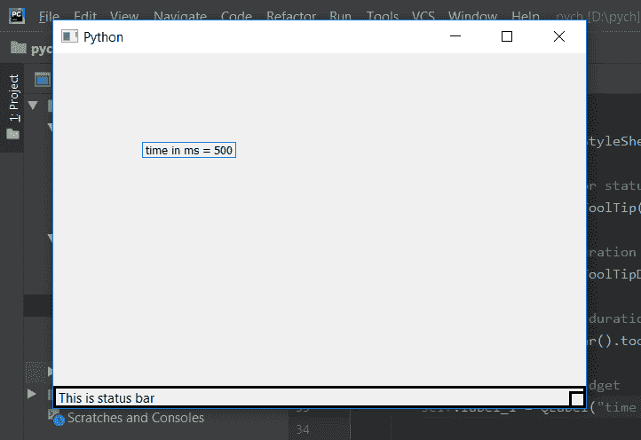

# PyQt5–进入状态栏的工具提示持续时间

> 原文:[https://www . geesforgeks . org/pyqt 5-访问-工具-提示-持续时间-状态栏/](https://www.geeksforgeeks.org/pyqt5-access-tool-tip-duration-of-status-bar/)

我们知道借助状态栏对象我们可以设置工具提示和工具提示持续时间。在本文中，我们将看到如何访问工具提示持续时间。为此，我们将对状态栏对象使用`toolTipDuration`方法。

> **语法:** self.statusBar()。工具提示持续时间()
> 
> **论证:**不需要论证。
> 
> **返回:**返回整数，指毫秒。

**代码:**

```py
from PyQt5.QtCore import * 
from PyQt5.QtGui import * 
from PyQt5.QtWidgets import * 
import sys

class Window(QMainWindow):
    def __init__(self):
        super().__init__()

        # set the title
        self.setWindowTitle("Python")

        # setting  the geometry of window
        self.setGeometry(60, 60, 600, 400)

        # setting status bar message
        self.statusBar().showMessage("This is status bar")

        # setting  border
        self.statusBar().setStyleSheet("border :3px solid black;")

        # setting tool tip for status bar
        self.statusBar().setToolTip("Hello ! from status bar")

        # setting tool tip duration
        self.statusBar().setToolTipDuration(500)

        # accessing tool tip duration
        t = str(self.statusBar().toolTipDuration())

        # creating a label widget
        self.label_1 = QLabel("time in ms = " + t, self)

        # moving position
        self.label_1.move(100, 100)

        # setting up the border
        self.label_1.setStyleSheet("border :1px solid blue;")

        # resizing label
        self.label_1.adjustSize()

        # show all the widgets
        self.show()

# create pyqt5 app
App = QApplication(sys.argv)

# create the instance of our Window
window = Window()

# start the app
sys.exit(App.exec())
```

**输出:**
