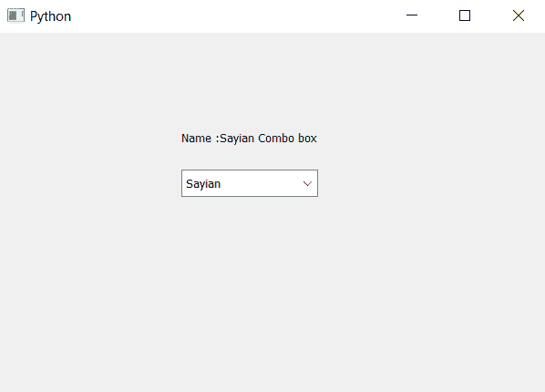

# PyQt5–访问组合框名称

> 原文:[https://www . geesforgeks . org/pyqt 5-access-name-of-combobox/](https://www.geeksforgeeks.org/pyqt5-accessing-name-of-combobox/)

在本文中，我们将看到如何访问组合框的名称。名称基本上是用来区分组合框的，程序员可以根据组合框的用途来命名组合框，以便于区分。默认情况下，组合框没有名称。为了设置名称，我们使用`setAccessibleName`方法。

为了访问组合框的名称，我们使用`accessibleName`方法。

> **语法:**组合框 _ accessiblename()
> 
> **论证:**不需要论证
> 
> **返回:**返回字符串

下面是实现

```
# importing libraries
from PyQt5.QtWidgets import * 
from PyQt5 import QtCore, QtGui
from PyQt5.QtGui import * 
from PyQt5.QtCore import * 
import sys

class Window(QMainWindow):

    def __init__(self):
        super().__init__()

        # setting title
        self.setWindowTitle("Python ")

        # setting geometry
        self.setGeometry(100, 100, 600, 400)

        # calling method
        self.UiComponents()

        # showing all the widgets
        self.show()

    # method for widgets
    def UiComponents(self):

        # creating a combo box widget
        self.combo_box = QComboBox(self)

        # setting geometry of combo box
        self.combo_box.setGeometry(200, 150, 150, 30)

        # geek list
        geek_list = ["Sayian", "Super Sayian"]

        # making it editable
        self.combo_box.setEditable(True)

        # adding list of items to combo box
        self.combo_box.addItems(geek_list)

        # name
        name = "Sayian Combo box"

        # setting name to the combo box
        self.combo_box.setAccessibleName(name)

        # getting the name
        get_name = self.combo_box.accessibleName()

        # creating label to show the name
        label = QLabel("Name :" + get_name, self)

        # setting geometry of the label
        label.setGeometry(200, 100, 200, 30)

# create pyqt5 app
App = QApplication(sys.argv)

# create the instance of our Window
window = Window()

# start the app
sys.exit(App.exec())
```

**输出:**
