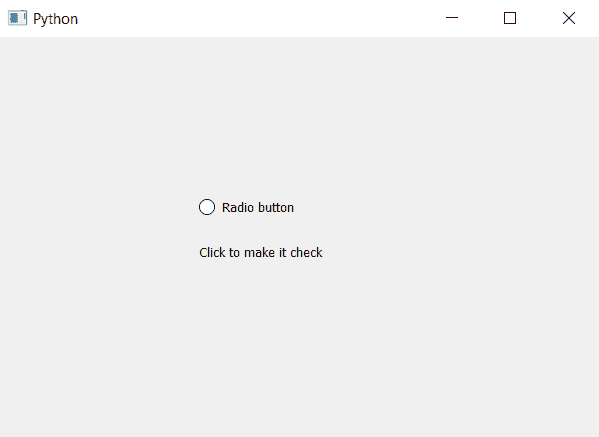

# PyQt5–访问单选按钮工具提示内容

> 原文:[https://www . geesforgeks . org/pyqt 5-访问-单选按钮-工具提示-内容/](https://www.geeksforgeeks.org/pyqt5-accessing-radio-button-tooltip-content/)

在本文中，我们将了解如何访问单选按钮的工具提示内容。工具提示基本上是我们将鼠标悬停在单选按钮上时出现的消息。工具提示提供提示，帮助用户更好地理解单选按钮。

为了访问单选按钮工具提示的内容，我们将使用`toolTip`方法

> **语法:**单选按钮。工具提示()
> 
> **论证:**不需要论证
> 
> **返回:**返回字符串

下面是实现

```
# importing libraries
from PyQt5.QtWidgets import * 
from PyQt5 import QtCore, QtGui
from PyQt5.QtGui import * 
from PyQt5.QtCore import * 
import sys

class Window(QMainWindow):

    def __init__(self):
        super().__init__()

        # setting title
        self.setWindowTitle("Python ")

        # setting geometry
        self.setGeometry(100, 100, 600, 400)

        # calling method
        self.UiComponents()

        # showing all the widgets
        self.show()

    # method for widgets
    def UiComponents(self):
        # creating a radio button
        self.radio_button = QRadioButton("Radio button", self)

        # setting geometry of radio button
        self.radio_button.setGeometry(200, 150, 120, 40)

        # setting tool tip
        self.radio_button.setToolTip("Click to make it check")

        # setting tool tip duration
        self.radio_button.setToolTipDuration(2000)

        # creating a label
        label = QLabel(self)

        # setting geometry of the label
        label.setGeometry(200, 200, 300, 30)

        # accessing the tool tip content
        content = self.radio_button.toolTip()

        # printing content through label
        label.setText(content)

# create pyqt5 app
App = QApplication(sys.argv)

# create the instance of our Window
window = Window()

# start the app
sys.exit(App.exec())
```

**输出:**
