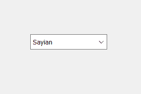

# PyQt5–给组合框添加边框

> 原文:[https://www.geeksforgeeks.org/pyqt5-add-border-to-combobox/](https://www.geeksforgeeks.org/pyqt5-add-border-to-combobox/)

在这篇文章中，我们将看到如何添加边框到组合框，默认情况下组合框有边框，虽然我们可以改变边框。下面是普通组合框和自定义边框组合框的图示。

 

为了做到这一点，我们必须更改与组合框关联的样式表，下面是样式表代码–

```
QComboBox
{
border : 3px solid blue;
}

```

下面是实现

```
# importing libraries
from PyQt5.QtWidgets import * 
from PyQt5 import QtCore, QtGui
from PyQt5.QtGui import *
from PyQt5.QtCore import * 
import sys

class Window(QMainWindow):

    def __init__(self):
        super().__init__()

        # setting title
        self.setWindowTitle("Python ")

        # setting geometry
        self.setGeometry(100, 100, 600, 400)

        # calling method
        self.UiComponents()

        # showing all the widgets
        self.show()

    # method for widgets
    def UiComponents(self):

        # creating a combo box widget
        self.combo_box = QComboBox(self)

        # setting geometry of combo box
        self.combo_box.setGeometry(200, 150, 150, 30)

        # making combo box editable
        self.combo_box.setEditable(True)

        # geek list
        geek_list = ["Sayian", "Super Sayian", "Super Sayian 2", "Super Sayian B"]

        # adding list of items to combo box
        self.combo_box.addItems(geek_list)

        # editing style sheet code of combo box
        # adding border to the combo box
        self.combo_box.setStyleSheet("QComboBox"
                                     "{"
                                     "border : 3px solid blue;"
                                     "}")

# create pyqt5 app
App = QApplication(sys.argv)

# create the instance of our Window
window = Window()

# start the app
sys.exit(App.exec())
```

**输出:**
