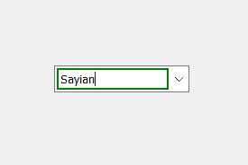
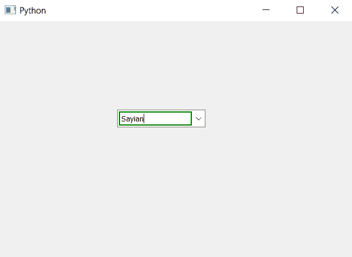

# PyQt5–为组合框的线条编辑部分添加边框

> 原文:[https://www . geeksforgeeks . org/pyqt 5-添加边框到线条编辑-部分组合框/](https://www.geeksforgeeks.org/pyqt5-add-border-to-lineedit-part-of-combobox/)

在本文中，我们将看到如何为组合框的线条编辑部分设置边框。行编辑部分是组合框中显示所选项的部分，本质上是可编辑的。为了设置和访问线编辑对象，我们分别使用`setLineEdit`和`lineEdit`方法。下面是普通组合框和线条编辑部分有边框的组合框的图示。

 

> 为此，请遵循以下步骤–
> 
> 1.创建组合框
> 2。向组合框
> 3 添加项目。创建一个 QLineEdit 对象
> 4。为 QLineEdit 对象设置边框
> 5。将 QLineEdit 对象添加到组合框中

**语法:**

```
# creating line edit object
line_edit = QLineEdit()

# setting border to the line edit
line_edit.setStyleSheet("QLineEdit"
                        "{"
                        "border : 2px solid green;"
                        "}")

# adding line edit object to the combo box
self.combo_box.setLineEdit(line_edit)

```

下面是实现

```
# importing libraries
from PyQt5.QtWidgets import * 
from PyQt5 import QtCore, QtGui
from PyQt5.QtGui import * 
from PyQt5.QtCore import * 
import sys

class Window(QMainWindow):

    def __init__(self):
        super().__init__()

        # setting title
        self.setWindowTitle("Python ")

        # setting geometry
        self.setGeometry(100, 100, 600, 400)

        # calling method
        self.UiComponents()

        # showing all the widgets
        self.show()

    # method for widgets
    def UiComponents(self):
        # creating a combo box widget
        self.combo_box = QComboBox(self)

        # setting geometry of combo box
        self.combo_box.setGeometry(200, 150, 150, 30)

        # geek list
        geek_list = ["Sayian", "Super Sayian", "Super Sayian 2", "Super Sayian B"]

        # adding list of items to combo box
        self.combo_box.addItems(geek_list)

        # creating line edit object
        line_edit = QLineEdit()

        # setting border to the line edit
        line_edit.setStyleSheet("QLineEdit"
                                "{"
                                "border : 2px solid green;"
                                "}")

        # adding line edit object to the combo box
        self.combo_box.setLineEdit(line_edit)

# create pyqt5 app
App = QApplication(sys.argv)

# create the instance of our Window
window = Window()

# start the app
sys.exit(App.exec())
```

**输出:**
