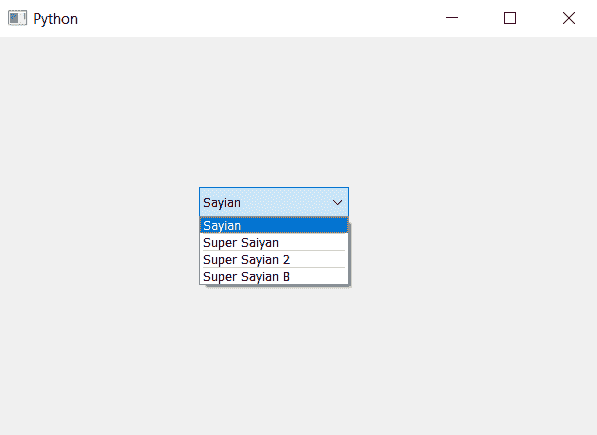

# PyQt5–在组合框的项目之间添加多个分隔符

> 原文:[https://www . geesforgeks . org/pyqt 5-add-多项分隔符-组合框中的项目/](https://www.geeksforgeeks.org/pyqt5-add-multiple-separator-in-between-item-of-combobox/)

在本文中，我们将看到如何在组合框的项目之间添加多个分隔符，默认情况下没有分隔符。分隔符是两个项目之间的黑线，为了添加分隔符，我们使用 insertSeparator 方法。下面是带有分隔符的组合框项目的外观图


为了添加多个分隔符，我们将多次使用 insertSeparator 方法，但首先给出最大索引的索引值，然后是第二个最大索引值，以此类推，如果我们首先给出最小索引值，那么其他语句只会增加最小索引值分隔符的大小。

> 仅在两个位置添加分隔符
> **语法:**
> 组合框.插入分隔符(最大(索引))
> 组合框.插入分隔符(最小(索引)
> 这里，索引是两个索引的列表
> **参数:**它以整数作为参数，即索引
> **执行的动作:**它将在给定的索引
> 处添加分隔符

下面是实现–

## 蟒蛇 3

```
# importing libraries
from PyQt5.QtWidgets import *
from PyQt5 import QtCore, QtGui
from PyQt5.QtGui import *
from PyQt5.QtCore import *
import sys

class Window(QMainWindow):

    def __init__(self):
        super().__init__()

        # setting title
        self.setWindowTitle("Python ")

        # setting geometry
        self.setGeometry(100, 100, 600, 400)

        # calling method
        self.UiComponents()

        # showing all the widgets
        self.show()

    # method for widgets
    def UiComponents(self):

        # creating a combo box widget
        self.combo_box = QComboBox(self)

        # setting geometry of combo box
        self.combo_box.setGeometry(200, 150, 150, 30)

        # geek list
        geek_list = ["Sayian", "Super Saiyan", "Super Sayian 2", "Super Sayian B"]

        # adding list of items to combo box
        self.combo_box.addItems(geek_list)

        # index list
        indexs = [1, 3, 2]

        # adding separator at maximum index
        self.combo_box.insertSeparator(max(indexs))

        # adding separator at middle index
        index = 0
        for i in indexs:
            if i > min(indexs) and i < max(indexs):
                index = i
        self.combo_box.insertSeparator(index)

        # adding separator at minimum index
        self.combo_box.insertSeparator(min(indexs))

# create pyqt5 app
App = QApplication(sys.argv)

# create the instance of our Window
window = Window()

# start the app
sys.exit(App.exec())
```

**输出:**

