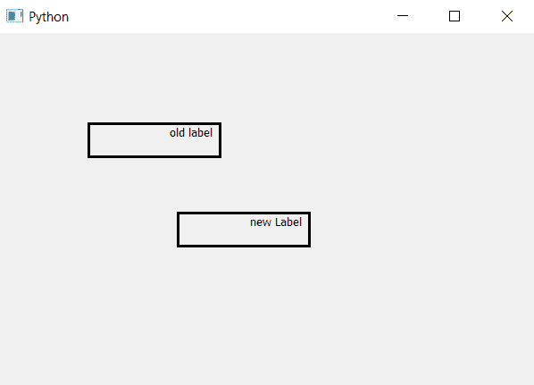

# PyQt5–标签的对齐()方法

> 原文:[https://www . geesforgeks . org/pyqt 5-标签比对方法/](https://www.geeksforgeeks.org/pyqt5-alignment-method-for-label/)

在本文中，我们将看到关于`alignment()`的方法。此方法用于了解标签的对齐类型。我们使用`setAlignment()`方法设置对齐，`alignment()`方法返回 Qt。对齐对象，这是`setAlignment()`方法的参数。

> **语法:** label.alignment()
> 
> **论证:**不需要论证。
> 
> **返回:**返回 Qt。对齐对象

**代码:**

```
# importing the required libraries

from PyQt5.QtCore import * 
from PyQt5.QtGui import * 
from PyQt5.QtWidgets import * 
import sys

class Window(QMainWindow):
    def __init__(self):
        super().__init__()

        # set the title
        self.setWindowTitle("Python")

        # setting geometry
        self.setGeometry(100, 100, 600, 400)

        # creating a label widget
        self.label_1 = QLabel("old label ", self)

        # setting up the border
        self.label_1.setStyleSheet("border :3px solid black;")

        # setting the alignment of the label
        self.label_1.setAlignment(Qt.AlignRight)

        # getting he alignment of the label
        align = self.label_1.alignment()

        # printing the align of label
        print(align)

        # resizing the label
        self.label_1.resize(150, 40)

        # moving the label
        self.label_1.move(100, 100)

        # creating a new label widget
        self.label_2 = QLabel("new Label ", self)

        # setting up the border
        self.label_2.setStyleSheet("border :3px solid black;")

        # moving the label
        self.label_2.move(200, 200)

        # resizing the label
        self.label_2.resize(150, 40)

        # setting the alignment using label_1 alignment
        self.label_2.setAlignment(align)

        # show all the widgets
        self.show()

# create pyqt5 app
App = QApplication(sys.argv)

# create the instance of our Window
window = Window()

# start the app
sys.exit(App.exec())
```

**输出:**

```
PyQt5.QtCore.Qt.Alignment object at 0x0000021C0076E828
```

