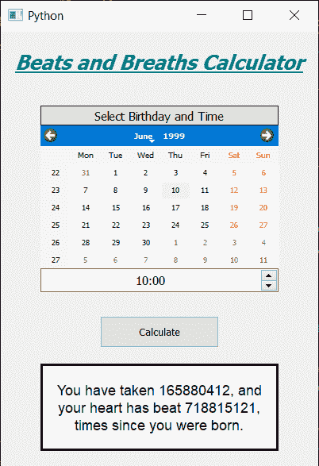

# pyqt 5–心跳和呼吸计算器

> 原文:[https://www . geeksforgeeks . org/pyqt5-节拍和呼吸-计算器/](https://www.geeksforgeeks.org/pyqt5-beats-and-breaths-calculator/)

在本文中，我们将了解如何使用 PyQt5 创建心跳和呼吸计算器。下面是计算器的外观。


成年人的正常静息心率为每分钟 60 到 100 次。一般来说，休息时较低的心率意味着更有效的心脏功能和更好的心血管健康。例如，一名训练有素的运动员的正常静息心率可能接近每分钟 40 次。

**呼吸频率:**一个人的呼吸频率就是你每分钟呼吸的次数。成年人休息时的正常呼吸频率是每分钟 12 到 20 次呼吸。休息时每分钟呼吸低于 12 次或超过 25 次被认为是不正常的。

> **GUI 实现步骤:**
> 1。创建显示计算器名称
> 2 的标题标签。创建标签显示用户选择出生日期和出生时间
> 3。创建一个 QCalendarWidget 对象供用户选择出生日期
> 4。创建一个 QTimeEdit 对象获取出生时间
> 5。创建一个按钮来计算心跳和呼吸
> 6。创建一个标签来显示计算出的节拍和呼吸
> 
> **后端实现:**
> 1。制作日历未来日期块，即将当前日期设为最大日期
> 2。给按钮增加动作
> 3。在按钮操作中，从日历中获取日期，从
> 4 中获取时间。从日期获取日、月、年，从时间编辑
> 5 获取小时、分钟。为当前日期和出生日期创建日期时间对象
> 6。从两个日期中得到差值，得到天数和秒数
> 7。将日和秒转换为分钟
> 8。将分钟数乘以平均心率，得到心跳和呼吸。
> 9。借助标签显示计算出的节拍和呼吸

下面是实现

```py
# importing libraries
from PyQt5.QtWidgets import * 
from PyQt5 import QtCore, QtGui
from PyQt5.QtGui import * 
from PyQt5.QtCore import * 
import datetime
import sys

class Window(QMainWindow):

    def __init__(self):
        super().__init__()

        # setting title
        self.setWindowTitle("Python ")

        # width of window
        self.w_width = 400

        # height of window
        self.w_height = 550

        # setting geometry
        self.setGeometry(100, 100, self.w_width, self.w_height)

        # calling method
        self.UiComponents()

        # showing all the widgets
        self.show()

    # method for components
    def UiComponents(self):
        # creating head label
        head = QLabel("Beats and Breaths Calculator", self)

        head.setWordWrap(True)

        # setting geometry to the head
        head.setGeometry(0, 10, 400, 60)

        # font
        font = QFont('Times', 15)
        font.setBold(True)
        font.setItalic(True)
        font.setUnderline(True)

        # setting font to the head
        head.setFont(font)

        # setting alignment of the head
        head.setAlignment(Qt.AlignCenter)

        # setting color effect to the head
        color = QGraphicsColorizeEffect(self)
        color.setColor(Qt.darkCyan)
        head.setGraphicsEffect(color)

        # creating a label
        b_label = QLabel("Select Birthday and Time", self)

        # setting properties  label
        b_label.setAlignment(Qt.AlignCenter)
        b_label.setGeometry(50, 95, 300, 25)
        b_label.setStyleSheet("QLabel"
                              "{"
                              "border : 1px solid black;"
                              "background : rgba(70, 70, 70, 25);"
                              "}")
        b_label.setFont(QFont('Times', 9))

        # creating a calendar widget to select the date
        self.calendar = QCalendarWidget(self)

        # setting geometry of the calendar
        self.calendar.setGeometry(50, 120, 300, 180)

        # setting font to the calendar
        self.calendar.setFont(QFont('Times', 6))

        # getting current date
        date = QDate.currentDate()

        # blocking future dates
        self.calendar.setMaximumDate(date)

        # creating a time edit object to receive time
        self.time = QTimeEdit(self)

        # setting properties to the time
        self.time.setGeometry(50, 300, 300, 30)
        self.time.setAlignment(Qt.AlignCenter)
        self.time.setFont(QFont('Times', 9))

        # creating a push button
        calculate = QPushButton("Calculate", self)

        # setting geometry to the push button
        calculate.setGeometry(125, 360, 150, 40)

        # adding action to the calculate button
        calculate.clicked.connect(self.calculate_action)

        # creating a label to show percentile
        self.result = QLabel(self)

        # setting properties to result label
        self.result.setAlignment(Qt.AlignCenter)
        self.result.setGeometry(50, 420, 300, 110)
        self.result.setWordWrap(True)
        self.result.setStyleSheet("QLabel"
                                  "{"
                                  "border : 3px solid black;"
                                  "background : white;"
                                  "}")
        self.result.setFont(QFont('Arial', 11))

    def calculate_action(self):
        # getting birth date day
        birth = self.calendar.selectedDate()

        # getting year and month day of birth day
        birth_year = birth.year()
        birth_month = birth.month()
        birth_day = birth.day()

        # getting time of from the time edit
        time = self.time.time()

        # getting hour and seconds
        hour = time.hour()
        minute = time.minute()

        # getting today date
        current = QDate.currentDate()

        # getting year and month day of current day
        current = datetime.datetime.now()

        # coverting  date into date object
        birth_date = datetime.datetime(birth_year, birth_month, birth_day, hour, minute, 0)

        # getting difference in both the dates
        difference = current - birth_date

        # getting difference in days
        days = difference.days

        # setting seconds
        seconds = difference.seconds

        # converting days and seconds into minutes
        minutes = seconds / 60 + days * 24 * 60

        heartbeat = int(minutes * 65)

        breath = int(minutes * 15)

        # setting this value with the help of label
        self.result.setText("You have taken " + str(breath) +
                            ", and your heart has beat " + str(heartbeat) +
                            " times since you were born.")

# create pyqt5 app
App = QApplication(sys.argv)

# create the instance of our Window
window = Window()

# start the app
sys.exit(App.exec())
```

**输出:**

<video class="wp-video-shortcode" id="video-434889-1" width="640" height="880" preload="metadata" controls=""><source type="video/mp4" src="https://media.geeksforgeeks.org/wp-content/uploads/20200619014141/Python-2020-06-19-01-41-03.mp4?_=1">[https://media.geeksforgeeks.org/wp-content/uploads/20200619014141/Python-2020-06-19-01-41-03.mp4](https://media.geeksforgeeks.org/wp-content/uploads/20200619014141/Python-2020-06-19-01-41-03.mp4)</video>