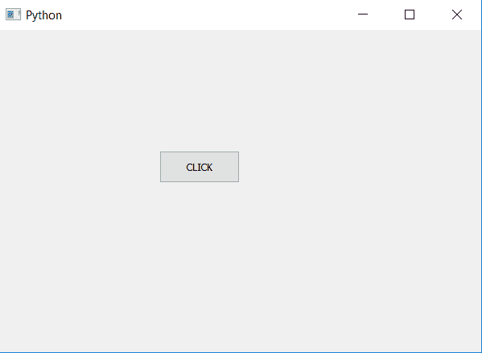
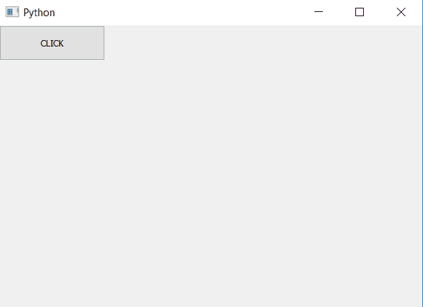

# pyqt 5–改变按钮尺寸

> 原文:[https://www . geesforgeks . org/pyqt 5-改变按钮大小/](https://www.geeksforgeeks.org/pyqt5-change-size-of-push-button/)

在本文中，我们将看到如何改变按钮的大小。为了改变按钮的大小，基本上有两种方法，即使用`resize`方法和`setGeometry`方法。
它们之间的主要区别是`resize`方法只会调整按钮的大小。另一方面`setGeometry`方法会改变大小，还会设置按钮的位置。

**方法#1:**

> **语法:** button.setGeometry(左侧，顶部，宽度，高度)
> 
> **自变量:**它以四个整数为自变量，前两个是位置，后两个是大小。
> 
> **执行的动作:**设置按钮的位置和大小。

**代码:**

```py
# importing libraries
from PyQt5.QtWidgets import * 
from PyQt5.QtGui import * 
from PyQt5.QtCore import * 
import sys

class Window(QMainWindow):
    def __init__(self):
        super().__init__()

        # setting title
        self.setWindowTitle("Python ")

        # setting geometry
        self.setGeometry(100, 100, 600, 400)

        # calling method
        self.UiComponents()

        # showing all the widgets
        self.show()

    # method for widgets
    def UiComponents(self):

        # creating a push button
        button = QPushButton("CLICK", self)

        # setting geometry of button
        button.setGeometry(200, 150, 100, 40)

        # adding action to a button
        button.clicked.connect(self.clickme)

    # action method
    def clickme(self):

        # printing pressed
        print("pressed")

# create pyqt5 app
App = QApplication(sys.argv)

# create the instance of our Window
window = Window()

# start the app
sys.exit(App.exec())
```

**输出:**


**方法 2:**

> **语法:**按钮。调整大小(宽度，高度)
> 
> **自变量:**取两个整数作为自变量，即宽度和高度。
> 
> **执行的动作:**设置按钮的大小

**代码:**

```py
# importing libraries
from PyQt5.QtWidgets import * 
from PyQt5.QtGui import * 
from PyQt5.QtCore import * 
import sys

class Window(QMainWindow):
    def __init__(self):
        super().__init__()

        # setting title
        self.setWindowTitle("Python ")

        # setting geometry
        self.setGeometry(100, 100, 600, 400)

        # calling method
        self.UiComponents()

        # showing all the widgets
        self.show()

    # method for widgets
    def UiComponents(self):

        # creating a push button
        button = QPushButton("CLICK", self)

        # setting size of button
        button.resize(150, 50)

        # adding action to a button
        button.clicked.connect(self.clickme)

    # action method
    def clickme(self):

        # printing pressed
        print("pressed")

# create pyqt5 app
App = QApplication(sys.argv)

# create the instance of our Window
window = Window()

# start the app
sys.exit(App.exec())
```

**输出:**
