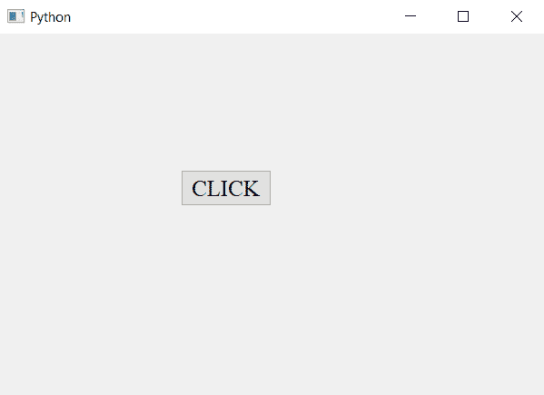

# PyQt5–在按钮

中更改文本字体和大小

> 原文:[https://www . geesforgeks . org/pyqt 5-更改按钮中的文本字体和大小/](https://www.geeksforgeeks.org/pyqt5-change-the-text-font-and-size-in-push-button/)

在本文中，我们将看到如何更改按钮的文本样式或大小。
**qbutton**是 PyQt 中的一个简单按钮，当用户点击时，会执行一些相关的动作。为了将这个按钮添加到应用程序中，使用了 button 类。
为了设置字体，我们将使用以 QFont 对象为参数的 set font 方法。

> **语法:** button.setFont(QFont('Arial '，15))
> **参数:**它需要两个参数，一个是字体名称，另一个是引用文本大小的整数。
> **执行的动作**改变文本的大小和字体。

**代码:**

## 蟒蛇 3

```
# importing libraries
from PyQt5.QtWidgets import *
from PyQt5.QtGui import *
from PyQt5.QtCore import *
import sys

class Window(QMainWindow):
    def __init__(self):
        super().__init__()

        # setting title
        self.setWindowTitle("Python ")

        # setting geometry
        self.setGeometry(100, 100, 600, 400)

        # calling method
        self.UiComponents()

        # showing all the widgets
        self.show()

    # method for widgets
    def UiComponents(self):

        # creating a push button
        button = QPushButton("CLICK", self)

        # setting geometry of button
        button.setGeometry(200, 150, 100, 40)

        # changing font and size of text
        button.setFont(QFont('Times', 15))

        # adding action to a button
        button.clicked.connect(self.clickme)

    # action method
    def clickme(self):

        # printing pressed
        print("pressed")

# create pyqt5 app
App = QApplication(sys.argv)

# create the instance of our Window
window = Window()

# start the app
sys.exit(App.exec())
```

**输出:**

