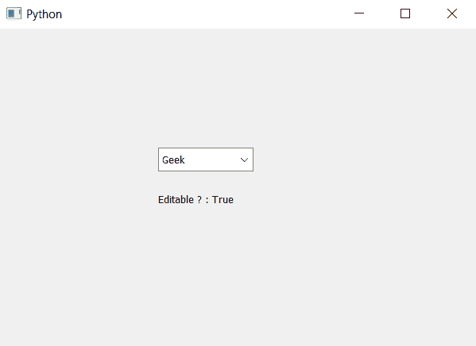

# PyQt5–检查组合框是否可编辑

> 原文:[https://www . geesforgeks . org/pyqt 5-checking-if-combobox-is-edited-or-not/](https://www.geeksforgeeks.org/pyqt5-checking-if-combobox-is-editable-or-not/)

在本文中，我们将了解如何知道组合框是否可编辑。可编辑的组合框是这样的，用户可以通过键入来更改它的值。默认情况下，当我们创建一个组合框时，我们只能从下拉菜单中选择选项，尽管在可编辑的组合框中，我们可以自己设置文本。为了制作可编辑的组合框，我们使用`setEditable`方法

为了检查组合框是否可编辑，我们使用`isEditable`，

> **语法:** combo_box.isEditable()
> 
> **论证:**不需要论证
> 
> **返回:**返回 bool

以下是实施–

```py
# importing libraries
from PyQt5.QtWidgets import * 
from PyQt5 import QtCore, QtGui
from PyQt5.QtGui import * 
from PyQt5.QtCore import * 
import sys

class Window(QMainWindow):

    def __init__(self):
        super().__init__()

        # setting title
        self.setWindowTitle("Python ")

        # setting geometry
        self.setGeometry(100, 100, 600, 400)

        # calling method
        self.UiComponents()

        # showing all the widgets
        self.show()

    # method for widgets
    def UiComponents(self):

        # creating a combo box widget
        self.combo_box = QComboBox(self)

        # setting geometry of combo box
        self.combo_box.setGeometry(200, 150, 120, 30)

        # geek list
        geek_list = ["Geek", "Geeky Geek", "Legend Geek", "Ultra Legend Geek"]

        # adding list of items to combo box
        self.combo_box.addItems(geek_list)

        # creating a editable combo box
        self.combo_box.setEditable(True)

        # checking if it is editable or not
        check = self.combo_box.isEditable()

        # creating label to show the status
        label = QLabel("Editable ? : " + str(check), self)

        # setting geometry of label
        label.setGeometry(200, 200, 200, 30)

# create pyqt5 app
App = QApplication(sys.argv)

# create the instance of our Window
window = Window()

# start the app
sys.exit(App.exec())
```

**输出:**
