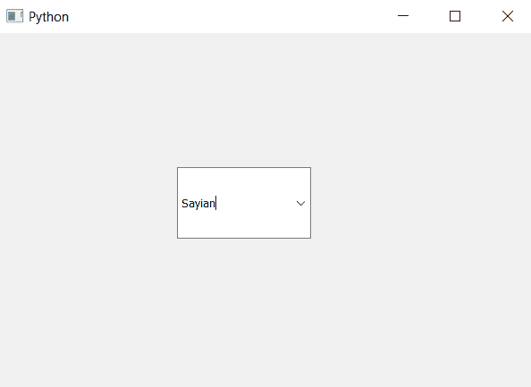
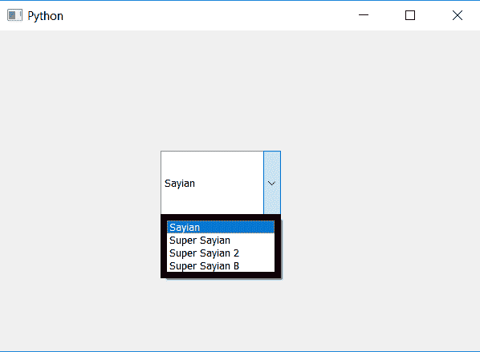
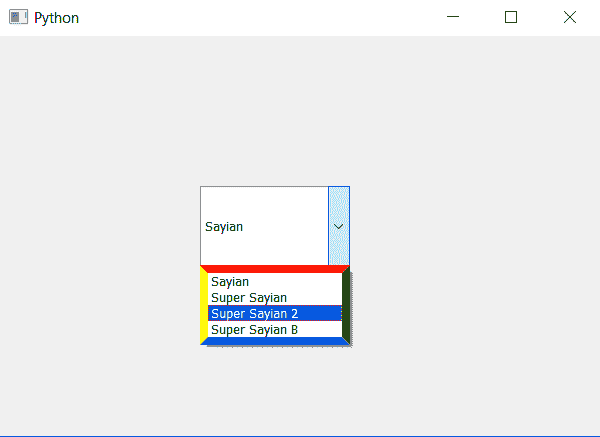

# PyQt5 组合框–鼠标悬停在列表视图上时不同的边框颜色

> 原文:[https://www . geesforgeks . org/pyqt 5-组合框-不同边框-颜色-列表-鼠标悬停时查看/](https://www.geeksforgeeks.org/pyqt5-combo-box-different-border-color-to-list-view-when-mouse-hover-over-it/)

在本文中，我们将看到如何在鼠标悬停时为组合框的列表视图设置不同的边框颜色，列表视图是项目视图，即所有项目都可见的视图。当我们按下下拉箭头时，组合框列表视图被打开。借助`setView`方法，我们可以随时更改视图对象。

有两种方法可以做到这一点:创建我们自己的视图，改变它的边框，然后将它添加到组合框中，但这是一个漫长的过程，因为我们必须向其中添加所有的项目，另一种方法是改变默认视图的样式表，即列表视图。

以下是样式表代码–
**代码 1**

```py
QListView::hover
{
border : 8px solid;
border-color-top : red;
border-color-right : green;
border-color-bottom : blue;
border-color-left : yellow;
}

```

或者

**代码 2**

```py
QListView::hover
{
border : 5px solid;
border-color : red green blue yellow;
}

```

下面是实现

```py
# importing libraries
from PyQt5.QtWidgets import * 
from PyQt5 import QtCore, QtGui
from PyQt5.QtGui import * 
from PyQt5.QtCore import * 
import sys

class Window(QMainWindow):

    def __init__(self):
        super().__init__()

        # setting title
        self.setWindowTitle("Python ")

        # setting geometry
        self.setGeometry(100, 100, 600, 400)

        # calling method
        self.UiComponents()

        # showing all the widgets
        self.show()

    # method for widgets
    def UiComponents(self):
        # creating a check-able combo box object
        self.combo_box = QComboBox(self)

        # setting geometry of combo box
        self.combo_box.setGeometry(200, 150, 150, 80)

        # making combo box editable
        self.combo_box.setEditable(True)

        # geek list
        geek_list = ["Sayian", "Super Sayian", "Super Sayian 2", "Super Sayian B"]

        # adding list of items to combo box
        self.combo_box.addItems(geek_list)

        # setting style sheet
        # adding different border color to the list view when mouse hover
        self.combo_box.setStyleSheet("QListView"
                                     "{"
                                     "border : 8px solid black;"
                                     "}"
                                     "QListView::hover"
                                     "{"
                                     "border : 8px solid;"
                                     "border-color : red green blue yellow;"
                                     "}")

# create pyqt5 app
App = QApplication(sys.argv)

# create the instance of our Window
window = Window()

window.show()

# start the app
sys.exit(App.exec())
```

输出:



列表视图打开时


当鼠标悬停在上面
**** 时