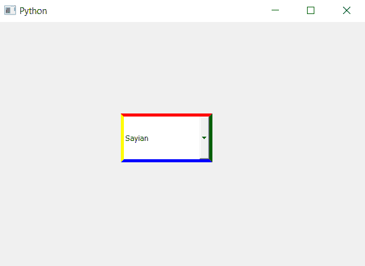

# PyQt5 组合框–可编辑和关闭状态时的不同边框颜色

> 原文:[https://www . geeksforgeeks . org/pyqt 5-combobox-不同-边框-可编辑时颜色-关闭状态/](https://www.geeksforgeeks.org/pyqt5-combobox-different-border-color-when-editable-and-off-state/)

在本文中，我们将看到如何在组合框处于可编辑和关闭状态时为其设置不同的边框颜色，当我们为组合框设置边框时，尽管我们可以分别更改每条边的颜色，但它对所有边都是相同的颜色。只有组合框可编辑且项目视图未打开时，才会出现彩色边框。

**注意:**组合框可以借助`setEditable`方法进行编辑。

为此，我们必须更改与组合框相关联的样式表，下面是样式表代码
**代码 1**

```py
QComboBox::editable:!on
{
border : 5px solid;
border-color-top : red;
border-color-right : green;
border-color-bottom : blue;
border-color-left : yellow;
}

```

**代码 2**

```py
QComboBox::editable:!on
{
border : 5px solid;
border-color : red green blue yellow
}

```

这两个代码执行类似的任务，只是代码 1 是代码 2 的扩展版本。

下面是实现

```py
# importing libraries
from PyQt5.QtWidgets import * 
from PyQt5 import QtCore, QtGui
from PyQt5.QtGui import * 
from PyQt5.QtCore import * 
import sys

class Window(QMainWindow):

    def __init__(self):
        super().__init__()

        # setting title
        self.setWindowTitle("Python ")

        # setting geometry
        self.setGeometry(100, 100, 600, 400)

        # calling method
        self.UiComponents()

        # showing all the widgets
        self.show()

    # method for widgets
    def UiComponents(self):
        # creating a check-able combo box object
        self.combo_box = QComboBox(self)

        # setting geometry of combo box
        self.combo_box.setGeometry(200, 150, 150, 80)

        # making combo box editable
        self.combo_box.setEditable(True)

        # geek list
        geek_list = ["Sayian", "Super Sayian", "Super Sayian 2", "Super Sayian B"]

        # adding list of items to combo box
        self.combo_box.addItems(geek_list)

        # setting style sheet
        # adding border to combo box
        # adding different width border when it is editable and in off state
        self.combo_box.setStyleSheet("QComboBox"
                                     "{"
                                     "border : 5px solid black;"
                                     "}"
                                     "QComboBox::editable:! on"
                                     "{"
                                     "border : 5px solid;"
                                     "border-color : red green blue yellow"
                                     "}")

# create pyqt5 app
App = QApplication(sys.argv)

# create the instance of our Window
window = Window()

window.show()

# start the app
sys.exit(App.exec())
```

**输出:**
