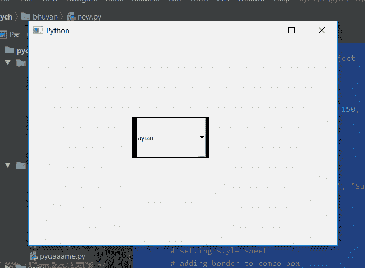

# PyQt5 组合框–不可编辑时边框宽度不同

> 原文:[https://www . geeksforgeeks . org/pyqt 5-combobox-different-border-width-when-不可编辑/](https://www.geeksforgeeks.org/pyqt5-combobox-different-border-width-when-non-editable/)

在本文中，我们将看到当组合框处于不可编辑状态时，我们如何为组合框设置不同的边框宽度，当我们为组合框设置边框时，它的所有边的宽度都是相同的。虽然我们可以分别更改每条边的宽度，但不同宽度的边框只会在组合框不可编辑时出现，否则它将显示正常的边框。借助`setEditable`方法可以创建可编辑的组合框。

为此，我们必须更改与组合框相关联的样式表，下面是样式表代码
**代码 1**

```py
QComboBox::!editable
{
border : solid black;
border-width-top : 1px;
border-width-right : 5px;
border-width-bottom : 2px;
border-width-left : 10px;
}

```

**代码 2**

```py
QComboBox::!editable
{
border : solid black;
border-width : 1px 5px 2px 10pxk
}

```

这两个代码执行类似的任务，只是代码 1 是代码 2 的扩展版本。

下面是实现

```py
# importing libraries
from PyQt5.QtWidgets import * 
from PyQt5 import QtCore, QtGui
from PyQt5.QtGui import * 
from PyQt5.QtCore import * 
import sys

class Window(QMainWindow):

    def __init__(self):
        super().__init__()

        # setting title
        self.setWindowTitle("Python ")

        # setting geometry
        self.setGeometry(100, 100, 600, 400)

        # calling method
        self.UiComponents()

        # showing all the widgets
        self.show()

    # method for widgets
    def UiComponents(self):
        # creating a check-able combo box object
        self.combo_box = QComboBox(self)

        # setting geometry of combo box
        self.combo_box.setGeometry(200, 150, 150, 80)

        # amking combo box editable
        # self.combo_box.setEditable(True)

        # geek list
        geek_list = ["Sayian", "Super Sayian", "Super Sayian 2", "Super Sayian B"]

        # adding list of items to combo box
        self.combo_box.addItems(geek_list)

        # setting style sheet
        # adding border to combo box
        # adding different width border when it is non-editable
        self.combo_box.setStyleSheet("QComboBox"
                                     "{"
                                     "border : 5px solid black;"
                                     "}"
                                     "QComboBox::! editable"
                                     "{"
                                     "border : solid black;"
                                     "border-width : 1px 5px 2px 10px;"
                                     "}")

# create pyqt5 app
App = QApplication(sys.argv)

# create the instance of our Window
window = Window()

window.show()

# start the app
sys.exit(App.exec())
```

**输出:**
