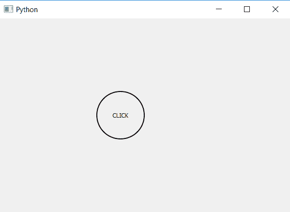

# PyQt5–创建圆形按钮

> 原文:[https://www . geesforgeks . org/pyqt 5-create-circular-button/](https://www.geeksforgeeks.org/pyqt5-create-circular-push-button/)

在本文中，我们将看到如何创建圆形按钮。默认情况下，当我们创建一个按钮时，它是矩形的，尽管我们也可以将其大小更改为方形。

> **为了创建圆形按钮，我们必须执行以下步骤:**
> 
> 1.创建一个按钮。
> 2。改变它的大小，使它成为正方形。
> 3。将按钮半径设置为长度的一半或方形按钮。

**注意:**如果我们设置的半径大于长度的一半，则不会发生变化，因为该形状是不可能的。

> **语法:**button .set 样式表(“边框半径:50；”)
> 
> **自变量:**它以字符串为自变量。
> 
> **执行的动作:**设置按钮的半径。

**代码:**

```
# importing libraries
from PyQt5.QtWidgets import * 
from PyQt5.QtGui import * 
from PyQt5.QtCore import * 
import sys

class Window(QMainWindow):
    def __init__(self):
        super().__init__()

        # setting title
        self.setWindowTitle("Python ")

        # setting geometry
        self.setGeometry(100, 100, 600, 400)

        # calling method
        self.UiComponents()

        # showing all the widgets
        self.show()

    # method for widgets
    def UiComponents(self):

        # creating a push button
        button = QPushButton("CLICK", self)

        # setting geometry of button
        button.setGeometry(200, 150, 100, 100)

        # setting radius and border
        button.setStyleSheet("border-radius : 50; 
                              border : 2px solid black")

        # adding action to a button
        button.clicked.connect(self.clickme)

    # action method
    def clickme(self):

        # printing pressed
        print("pressed")

# create pyqt5 app
App = QApplication(sys.argv)

# create the instance of our Window
window = Window()

# start the app
sys.exit(App.exec())
```

**输出:**
