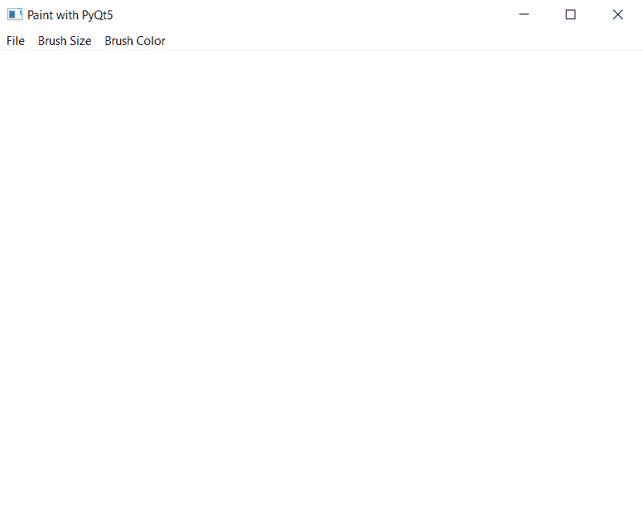
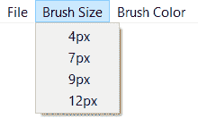

# PyQt5–创建油漆应用程序

> 原文:[https://www . geesforgeks . org/pyqt 5-create-paint-application/](https://www.geeksforgeeks.org/pyqt5-create-paint-application/)

Python 提供了这么多开发 GUI 应用程序的选项，PyQt5 就是其中之一。PyQt5 是跨平台的 GUI 工具包，是一组针对 Qt v5 的 python 绑定。由于该库提供的工具和简单性，人们可以非常容易地开发交互式桌面应用程序。

在本文中，我们将看到如何使用 PyQt5 创建一个 Paint 应用程序。我们的油漆应用将包括以下内容

特点:

1.  用户可以选择不同的刷子尺寸
2.  用户可以选择不同的画笔颜色
3.  画布的保存
4.  一次清理整个画布



> **设计小部件的步骤–**
> 1。创建窗口设置其几何图形和标题
> 2。创建菜单栏
> 3。菜单栏里面增加了不同的菜单，分别是文件菜单、大小菜单和颜色菜单
> 4。将保存和清除动作添加到文件菜单
> 
> 
> 
> 5.在笔刷大小菜单
> 中添加不同的笔刷大小动作
> 
> 
> 
> 6.在笔刷颜色菜单
> 中添加不同的笔刷颜色动作
> 
> 
> 
> 7.创建一个白色画布，并将其添加到窗口
> 
> **后端步骤:**
> 1。创建不同的变量:绘图标志检查当前是否绘图并设置为假，画笔大小变量设置当前画笔大小，画笔颜色设置当前画笔颜色，当前位置变量知道光标位置
> 2。向清除和保存小部件
> 3 添加操作。内部清晰动作用白色填充画布
> 4。在保存动作中保存画布
> 5。给各种笔刷大小和颜色添加动作(方法)来设置大小和颜色
> 6。创建绘画事件在屏幕上绘制白色画布
> 7。创建方法来知道鼠标左键何时被按下，该方法使绘图标记为真并改变当前位置
> 8。创建鼠标移动的方法，在这个方法中检查画图标志是否为真，按钮是否仍然被按下，然后使用画图对象进行画图，并根据需要改变位置。
> 9。创建一个方法知道鼠标按钮在这个方法中被释放使绘图标记为假。

下面是实现

## 蟒蛇 3

```py
# importing libraries
from PyQt5.QtWidgets import *
from PyQt5.QtGui import *
from PyQt5.QtCore import *
import sys

# window class
class Window(QMainWindow):
    def __init__(self):
        super().__init__()

        # setting title
        self.setWindowTitle("Paint with PyQt5")

        # setting geometry to main window
        self.setGeometry(100, 100, 800, 600)

        # creating image object
        self.image = QImage(self.size(), QImage.Format_RGB32)

        # making image color to white
        self.image.fill(Qt.white)

        # variables
        # drawing flag
        self.drawing = False
        # default brush size
        self.brushSize = 2
        # default color
        self.brushColor = Qt.black

        # QPoint object to tract the point
        self.lastPoint = QPoint()

        # creating menu bar
        mainMenu = self.menuBar()

        # creating file menu for save and clear action
        fileMenu = mainMenu.addMenu("File")

        # adding brush size to main menu
        b_size = mainMenu.addMenu("Brush Size")

        # adding brush color to ain menu
        b_color = mainMenu.addMenu("Brush Color")

        # creating save action
        saveAction = QAction("Save", self)
        # adding short cut for save action
        saveAction.setShortcut("Ctrl + S")
        # adding save to the file menu
        fileMenu.addAction(saveAction)
        # adding action to the save
        saveAction.triggered.connect(self.save)

        # creating clear action
        clearAction = QAction("Clear", self)
        # adding short cut to the clear action
        clearAction.setShortcut("Ctrl + C")
        # adding clear to the file menu
        fileMenu.addAction(clearAction)
        # adding action to the clear
        clearAction.triggered.connect(self.clear)

        # creating options for brush sizes
        # creating action for selecting pixel of 4px
        pix_4 = QAction("4px", self)
        # adding this action to the brush size
        b_size.addAction(pix_4)
        # adding method to this
        pix_4.triggered.connect(self.Pixel_4)

        # similarly repeating above steps for different sizes
        pix_7 = QAction("7px", self)
        b_size.addAction(pix_7)
        pix_7.triggered.connect(self.Pixel_7)

        pix_9 = QAction("9px", self)
        b_size.addAction(pix_9)
        pix_9.triggered.connect(self.Pixel_9)

        pix_12 = QAction("12px", self)
        b_size.addAction(pix_12)
        pix_12.triggered.connect(self.Pixel_12)

        # creating options for brush color
        # creating action for black color
        black = QAction("Black", self)
        # adding this action to the brush colors
        b_color.addAction(black)
        # adding methods to the black
        black.triggered.connect(self.blackColor)

        # similarly repeating above steps for different color
        white = QAction("White", self)
        b_color.addAction(white)
        white.triggered.connect(self.whiteColor)

        green = QAction("Green", self)
        b_color.addAction(green)
        green.triggered.connect(self.greenColor)

        yellow = QAction("Yellow", self)
        b_color.addAction(yellow)
        yellow.triggered.connect(self.yellowColor)

        red = QAction("Red", self)
        b_color.addAction(red)
        red.triggered.connect(self.redColor)

    # method for checking mouse cicks
    def mousePressEvent(self, event):

        # if left mouse button is pressed
        if event.button() == Qt.LeftButton:
            # make drawing flag true
            self.drawing = True
            # make last point to the point of cursor
            self.lastPoint = event.pos()

    # method for tracking mouse activity
    def mouseMoveEvent(self, event):

        # checking if left button is pressed and drawing flag is true
        if (event.buttons() & Qt.LeftButton) & self.drawing:

            # creating painter object
            painter = QPainter(self.image)

            # set the pen of the painter
            painter.setPen(QPen(self.brushColor, self.brushSize,
                            Qt.SolidLine, Qt.RoundCap, Qt.RoundJoin))

            # draw line from the last point of cursor to the current point
            # this will draw only one step
            painter.drawLine(self.lastPoint, event.pos())

            # change the last point
            self.lastPoint = event.pos()
            # update
            self.update()

    # method for mouse left button release
    def mouseReleaseEvent(self, event):

        if event.button() == Qt.LeftButton:
            # make drawing flag false
            self.drawing = False

    # paint event
    def paintEvent(self, event):
        # create a canvas
        canvasPainter = QPainter(self)

        # draw rectangle  on the canvas
        canvasPainter.drawImage(self.rect(), self.image, self.image.rect())

    # method for saving canvas
    def save(self):
        filePath, _ = QFileDialog.getSaveFileName(self, "Save Image", "",
                          "PNG(*.png);;JPEG(*.jpg *.jpeg);;All Files(*.*) ")

        if filePath == "":
            return
        self.image.save(filePath)

    # method for clearing every thing on canvas
    def clear(self):
        # make the whole canvas white
        self.image.fill(Qt.white)
        # update
        self.update()

    # methods for changing pixel sizes
    def Pixel_4(self):
        self.brushSize = 4

    def Pixel_7(self):
        self.brushSize = 7

    def Pixel_9(self):
        self.brushSize = 9

    def Pixel_12(self):
        self.brushSize = 12

    # methods for changing brush color
    def blackColor(self):
        self.brushColor = Qt.black

    def whiteColor(self):
        self.brushColor = Qt.white

    def greenColor(self):
        self.brushColor = Qt.green

    def yellowColor(self):
        self.brushColor = Qt.yellow

    def redColor(self):
        self.brushColor = Qt.red

# create pyqt5 app
App = QApplication(sys.argv)

# create the instance of our Window
window = Window()

# showing the window
window.show()

# start the app
sys.exit(App.exec())
```

**输出:**

<video class="wp-video-shortcode" id="video-400013-1" width="640" height="360" preload="metadata" controls=""><source type="video/mp4" src="https://media.geeksforgeeks.org/wp-content/uploads/20200420191723/screen_recorder_video_2020_20_4_19_11_53.mp4?_=1">[https://media.geeksforgeeks.org/wp-content/uploads/20200420191723/screen_recorder_video_2020_20_4_19_11_53.mp4](https://media.geeksforgeeks.org/wp-content/uploads/20200420191723/screen_recorder_video_2020_20_4_19_11_53.mp4)</video>