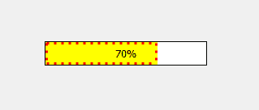
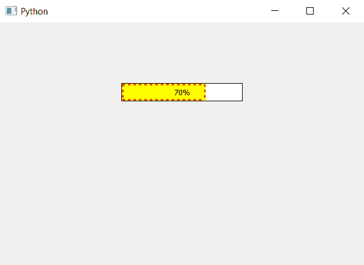

# PyQt5–进度条的虚线边框

> 原文:[https://www . geesforgeks . org/pyqt 5-虚线边框到进度条/](https://www.geeksforgeeks.org/pyqt5-dotted-border-to-bar-of-progress-bar/)

在本文中，我们将看到如何添加点状边框到进度条。下面是进度条的普通边框和虚线边框的图示。
 

为了做到这一点，我们必须改变 CSS 样式表中的边框样式，下面是样式表代码。

```py
QProgressBar
{
border : 1px solid black;
}
QProgressBar
{
border : 3px red;
border-style : dotted;
}

```

下面是实现。

```py
# importing libraries
from PyQt5.QtWidgets import * 
from PyQt5 import QtCore, QtGui
from PyQt5.QtGui import * 
from PyQt5.QtCore import *
import sys

class Window(QMainWindow):

    def __init__(self):
        super().__init__()

        # setting title
        self.setWindowTitle("Python ")

        # setting background color to window
        # self.setStyleSheet("background-color : yellow")

        # setting geometry
        self.setGeometry(100, 100, 600, 400)

        # calling method
        self.UiComponents()

        # showing all the widgets
        self.show()

    # method for widgets
    def UiComponents(self):
        # creating progress bar
        bar = QProgressBar(self)

        # setting geometry to progress bar
        bar.setGeometry(200, 100, 200, 30)

        # setting the value
        value = 70
        bar.setValue(value)

        # setting alignment to center
        bar.setAlignment(Qt.AlignCenter)

        # setting border to progress bar
        # and setting dotted border to the bar and color
        bar.setStyleSheet("QProgressBar "
                          "{"
                          "border : 1px solid black;"
                          "}"
                          "QProgressBar::chunk"
                          "{"
                          "background-color : yellow;"
                          "border :3px red;"
                          "border-style : dotted"
                          "}"
                          )

App = QApplication(sys.argv)

# create the instance of our Window
window = Window()

# start the app
sys.exit(App.exec())
```

**输出:**
