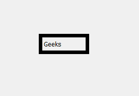
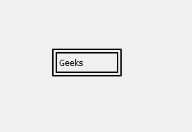
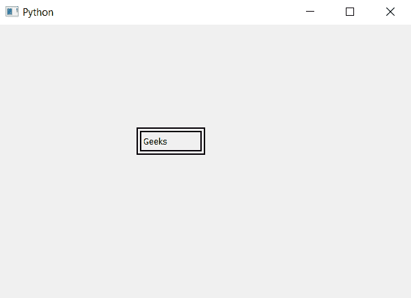

# PyQt5–标签的双边框

> 原文:[https://www . geesforgeks . org/pyqt 5-双边框转标签/](https://www.geeksforgeeks.org/pyqt5-double-border-to-a-label/)

在本文中，我们将看到如何对标签进行双边框。默认情况下，标签本身没有任何边框，尽管我们可以给标签添加边框。下面是单边框和双边框的外观。

 

为此我们将使用`setStyleSheet`方法。

> **语法:**label .set 样式表(“边框:7px 黑色；边框样式:双；”)
> 
> **自变量:**它以字符串为自变量。
> 
> **执行的动作:**会给标签增加双边框。

下面是实现。

```
# importing libraries
from PyQt5.QtWidgets import * 
from PyQt5 import QtCore, QtGui
from PyQt5.QtGui import * 
from PyQt5.QtCore import * 
import sys

class Window(QMainWindow):

    def __init__(self):
        super().__init__()

        # setting title
        self.setWindowTitle("Python ")

        # setting geometry
        self.setGeometry(100, 100, 600, 400)

        # calling method
        self.UiComponents()

        # showing all the widgets
        self.show()

    # method for widgets
    def UiComponents(self):

        # creating a label
        label = QLabel("Geeks", self)

        # setting geometry of label
        label.setGeometry(200, 150, 100, 40)

        # creating double border to the label
        label.setStyleSheet("border : 7px black; border-style : double;")

# create pyqt5 app
App = QApplication(sys.argv)

# create the instance of our Window
window = Window()

# start the app
sys.exit(App.exec())
```

**输出:**
