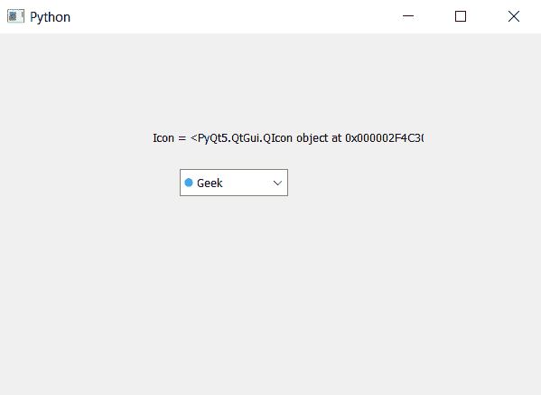

# PyQt5–在组合框

中获取所需项目的图标

> 原文:[https://www . geeksforgeeks . org/pyqt 5-获取所需物品图标组合框/](https://www.geeksforgeeks.org/pyqt5-get-the-icon-of-desired-item-in-combobox/)

在本文中，我们将看到如何获得所需组合框项目的图标。虽然我们可以借助`setItemIcon`方法为每个项目设置图标，但默认情况下，组合框中没有图标设置。

为了获得图标，我们将使用`itemIcon`方法

> **语法:** combobox.itemIcon(索引)
> 
> **自变量:**以整数为自变量，即索引
> 
> **返回:**将返回 QIcon 对象

以下是实施–

```
# importing libraries
from PyQt5.QtWidgets import * 
from PyQt5 import QtCore, QtGui
from PyQt5.QtGui import * 
from PyQt5.QtCore import * 
import sys

class Window(QMainWindow):

    def __init__(self):
        super().__init__()

        # setting title
        self.setWindowTitle("Python ")

        # setting geometry
        self.setGeometry(100, 100, 600, 400)

        # calling method
        self.UiComponents()

        # showing all the widgets
        self.show()

    # method for widgets
    def UiComponents(self):

        # creating a combo box widget
        self.combo_box = QComboBox(self)

        # setting geometry of combo box
        self.combo_box.setGeometry(200, 150, 120, 30)

        # geek list
        geek_list = ["Geek", "Geeky Geek"]

        # adding list of items to combo box
        self.combo_box.addItems(geek_list)

        # creating editable combo box
        self.combo_box.setEditable(True)

        # index
        index = 0

        # adding icon to the given index
        self.combo_box.setItemIcon(index, QIcon('logo.png'))

        # setting icon size
        self.combo_box.setIconSize(QSize(10, 10))

        # getting the icon
        icon = self.combo_box.itemIcon(0)

        # creating label to
        label = QLabel("Icon = " + str(icon), self)

        # setting geometry to the label
        label.setGeometry(170, 100, 300, 30)

# create pyqt5 app
App = QApplication(sys.argv)

# create the instance of our Window
window = Window()

# start the app
sys.exit(App.exec())
```

**输出:**
