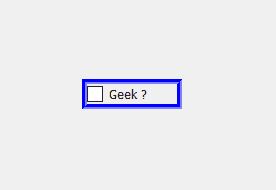
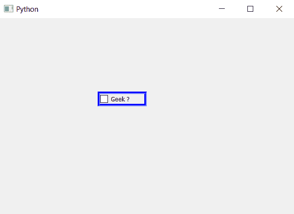

# PyQt5–复选框的凹槽边框

> 原文:[https://www . geeksforgeeks . org/pyqt 5-凹槽边框复选框/](https://www.geeksforgeeks.org/pyqt5-groove-border-of-check-box/)

在本文中，我们将看到如何设置凹槽边框复选框。默认情况下，复选框没有边框，虽然我们可以添加边框，但它将是普通边框。下面是凹槽边框复选框的表示。


为了给复选框添加凹槽边框，我们必须编辑与复选框对象一起使用的样式表。下面是 groove 边框的样式表代码。

```py
QCheckBox
{
border : 5px blue;
border-style : groove;
}

```

下面是实现。

```py
# importing libraries
from PyQt5.QtWidgets import * 
from PyQt5 import QtCore, QtGui
from PyQt5.QtGui import * 
from PyQt5.QtCore import * 
import sys

class Window(QMainWindow):

    def __init__(self):
        super().__init__()

        # setting title
        self.setWindowTitle("Python ")

        # setting geometry
        self.setGeometry(100, 100, 600, 400)

        # calling method
        self.UiComponents()

        # showing all the widgets
        self.show()

    # method for widgets
    def UiComponents(self):

        # creating the check-box
        checkbox = QCheckBox('Geek ?', self)

        # setting geometry of check box
        checkbox.setGeometry(200, 150, 100, 30)

        # adding groove border to the check box
        checkbox.setStyleSheet("QCheckBox"
                               "{"
                               "border : 5px solid blue;"
                               "border-style : groove;"
                               "}")

# create pyqt5 app
App = QApplication(sys.argv)

# create the instance of our Window
window = Window()

# start the app
sys.exit(App.exec())
```

**输出:**
