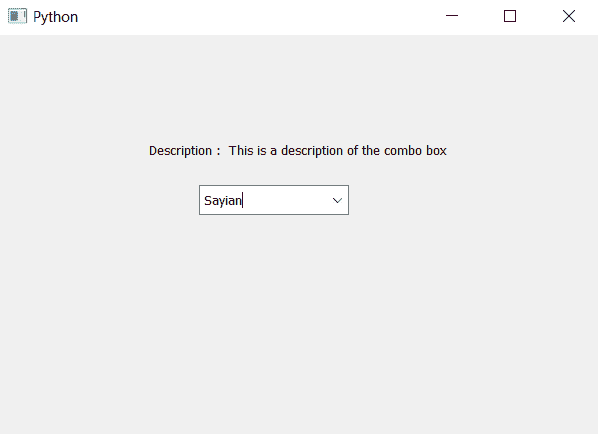

# PyQt5–如何访问组合框描述|访问描述方法

> 原文:[https://www . geesforgeks . org/pyqt 5-如何访问-combobox-description-accessibledescription-method/](https://www.geeksforgeeks.org/pyqt5-how-to-access-combobox-description-accessibledescription-method/)

在本文中，我们将看到如何访问组合框的描述。描述是关于组合框的详细信息，它讲述了功能用例和其他主要信息来理解组合框的工作，为了给组合框设置描述，我们使用`setAccessibleDescription`方法。

为了访问组合框的描述，我们使用`accessibleDescription`方法。

> **语法:**组合框. accessibleDescription()
> 
> **论证:**不需要论证
> 
> **返回:**返回字符串

**注意:**如果组合框中没有设置描述，则返回空字符串。

下面是实现

```
# importing libraries
from PyQt5.QtWidgets import * 
from PyQt5 import QtCore, QtGui
from PyQt5.QtGui import * 
from PyQt5.QtCore import * 
import sys

class Window(QMainWindow):

    def __init__(self):
        super().__init__()

        # setting title
        self.setWindowTitle("Python ")

        # setting geometry
        self.setGeometry(100, 100, 600, 400)

        # calling method
        self.UiComponents()

        # showing all the widgets
        self.show()

    # method for widgets
    def UiComponents(self):

        # creating a combo box widget
        self.combo_box = QComboBox(self)

        # setting geometry of combo box
        self.combo_box.setGeometry(200, 150, 150, 30)

        # geek list
        geek_list = ["Sayian", "Super Saiyan", "Super Sayian 2", "Super Sayian B"]

        # making it editable
        self.combo_box.setEditable(True)

        # adding list of items to combo box
        self.combo_box.addItems(geek_list)

        # description text
        text = " This is a description of the combo box "

        # setting description to the combo box
        self.combo_box.setAccessibleDescription(text)

        # getting the description
        get_text = self.combo_box.accessibleDescription()

        # creating label to show the description
        label = QLabel("Description : " + str(get_text), self)

        # setting geometry of the label
        label.setGeometry(150, 100, 300, 30)

# create pyqt5 app
App = QApplication(sys.argv)

# create the instance of our Window
window = Window()

# start the app
sys.exit(App.exec())
```

**输出:**
