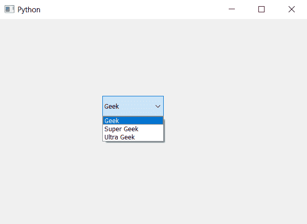

# PyQt5–如何向组合框中添加项目？

> 原文:[https://www . geeksforgeeks . org/pyqt 5-如何向组合框添加项目/](https://www.geeksforgeeks.org/pyqt5-how-to-add-an-item-to-the-combobox/)

在本文中，我们将看到如何向组合框中添加项目。默认情况下，组合框没有项目，为了给组合框添加项目，我们使用`addItem`方法。组合框将允许我们从添加的项目中进行选择。

> **语法:**组合框. addItem(项)
> 
> **自变量:**以字符串为自变量
> 
> **执行的动作:**将该项目添加到组合框的下拉列表中

下面是实现

```
# importing libraries
from PyQt5.QtWidgets import * 
from PyQt5 import QtCore, QtGui
from PyQt5.QtGui import * 
from PyQt5.QtCore import * 
import sys

class Window(QMainWindow):

    def __init__(self):
        super().__init__()

        # setting title
        self.setWindowTitle("Python ")

        # setting geometry
        self.setGeometry(100, 100, 600, 400)

        # calling method
        self.UiComponents()

        # showing all the widgets
        self.show()

    # method for widgets
    def UiComponents(self):

        # creating a combo box widget
        combo_box = QComboBox(self)

        # setting geometry of combo box
        combo_box.setGeometry(200, 150, 120, 40)

        # adding items to combo box
        # adding Geek to the combobox
        combo_box.addItem("Geek")
        # adding Super Geek to the combobox
        combo_box.addItem("Super Geek")
        # adding Ultra Geek to the combobox
        combo_box.addItem("Ultra Geek")

# create pyqt5 app
App = QApplication(sys.argv)

# create the instance of our Window
window = Window()

# start the app
sys.exit(App.exec())
```

**输出:**
