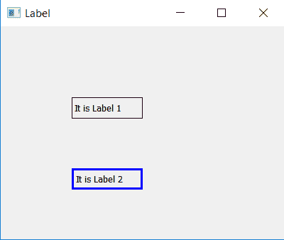

# PyQt5–如何在 QLabel 上添加边框？

> 原文:[https://www . geeksforgeeks . org/pyqt 5-如何添加 qlabel 上的边框/](https://www.geeksforgeeks.org/pyqt5-how-to-add-border-on-qlabel/)

当我们在 PyQt5 中创建标签时，我们可以看到没有像按钮中那样的边框，在本文中我们将看到如何给标签添加边框。

为了给标签添加边框，我们将使用`label.setStyleSheet()`方法，这将为标签添加边框，我们还可以设置边框的厚度和颜色。

> **语法:**label .set 样式表(“边框:1px 纯黑；”)
> 
> **自变量:**它以字符串作为自变量。
> 
> **执行的操作:**这将在标签上创建一个厚度为 1px 的边框，颜色为黑色。

下面是 Python 实现–

```py
# importing the required libraries

from PyQt5.QtWidgets import * 
from PyQt5.QtGui import * 
import sys

class Window(QMainWindow):
    def __init__(self):
        super().__init__()

        # set the title
        self.setWindowTitle("Label")

        # setting  the geometry of window
        self.setGeometry(0, 0, 400, 300)

        # creating a label widget
        # by default label will display at top left corner
        self.label_1 = QLabel('It is Label 1', self)

        # moving position
        self.label_1.move(100, 100)

        # setting up border
        self.label_1.setStyleSheet("border: 1px solid black;")

        # creating a label widget
        # by default label will display at top left corner
        self.label_2 = QLabel('It is Label 2', self)

        # moving position
        self.label_2.move(100, 200)

        # setting up border
        self.label_2.setStyleSheet("border: 3px solid blue;")

        # show all the widgets
        self.show()

# create pyqt5 app
App = QApplication(sys.argv)

# create the instance of our Window
window = Window()
# start the app
sys.exit(App.exec())
```

**输出:**
