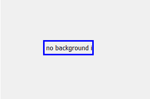
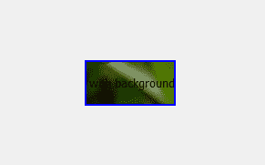
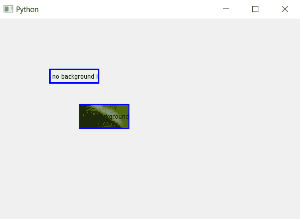

# pyqt 5–如何在标签背景中添加图像？

> 原文:[https://www . geesforgeks . org/pyqt 5-如何在标签中添加图像-背景/](https://www.geeksforgeeks.org/pyqt5-how-to-add-image-in-label-background/)

在本文中，我们将看到如何向标签添加背景图像，默认情况下，当我们创建标签时，虽然我们可以设置背景颜色，但没有背景图像。


有时背景图像是必要的。为了设置背景图像，我们将使用`setStyleSheet()`方法。


> **语法:**label .set 样式表(“背景-图像:URL(image . png)”；)
> 
> **自变量:**它以字符串为自变量。
> 
> **执行的操作**向标签添加背景图像。

**代码:**

```py
# importing the required libraries

from PyQt5.QtCore import * 
from PyQt5.QtGui import * 
from PyQt5.QtWidgets import * 
import sys

class Window(QMainWindow):
    def __init__(self):
        super().__init__()

        # set the title
        self.setWindowTitle("Python")

        # setting  the geometry of window
        self.setGeometry(60, 60, 600, 400)

        # creating a label widget
        self.label_1 = QLabel(self)

        # moving position
        self.label_1.move(100, 100)

        # setting up the border
        self.label_1.setStyleSheet("border :3px solid blue;")

        # setting label text
        self.label_1.setText("no background image")

        # creating a label widget
        self.label_2 = QLabel(self)

        # moving position
        self.label_2.move(160, 170)

        # setting up the border and adding image to background
        self.label_2.setStyleSheet("background-image : url(image.png);
                                              border : 2px solid blue")

        # setting label text
        self.label_2.setText("with background image")
        self.label_2.resize(100, 50)

        # show all the widgets
        self.show()

# create pyqt5 app
App = QApplication(sys.argv)

# create the instance of our Window
window = Window()
# start the app
sys.exit(App.exec())
```

**输出:**
