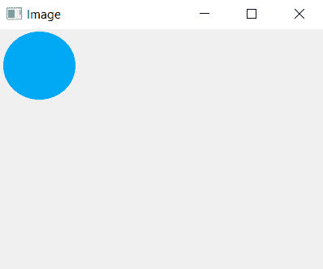

# pyqt 5–如何在窗口中添加图像？

> 原文:[https://www . geesforgeks . org/pyqt 5-如何在窗口中添加图像/](https://www.geeksforgeeks.org/pyqt5-how-to-add-image-in-window/)

在本文中，我们将看到如何向窗口添加图像。这样做的基本思想是首先使用 QPixmap 加载图像，并将加载的图像添加到标签中，然后根据图像的尺寸调整标签的大小，尽管调整大小部分是可选的。

为了使用 Qpixmap 和其他东西，我们必须导入以下库:

```py
from PyQt5.QtWidgets import *
from PyQt5.QtGui import QPixmap
import sys
```

> **用于加载图像:**
> **语法:**
> 
> ```py
> pixmap = QPixmap('image.png')
> ```
> 
> **参数:**如果图像在同一个文件夹中，则图像名称为 else 文件路径。
> 
> **用于向标签添加图像:**
> **语法:**
> 
> ```py
> label.setPixmap(pixmap)
> ```
> 
> **自变量:**它以 QPixmap 对象为自变量。

**代码:**

## 蟒蛇 3

```py
# importing the required libraries

from PyQt5.QtWidgets import *
from PyQt5.QtGui import QPixmap
import sys

class Window(QMainWindow):
    def __init__(self):
        super().__init__()

        self.acceptDrops()
        # set the title
        self.setWindowTitle("Image")

        # setting  the geometry of window
        self.setGeometry(0, 0, 400, 300)

        # creating label
        self.label = QLabel(self)

        # loading image
        self.pixmap = QPixmap('image.png')

        # adding image to label
        self.label.setPixmap(self.pixmap)

        # Optional, resize label to image size
        self.label.resize(self.pixmap.width(),
                          self.pixmap.height())

        # show all the widgets
        self.show()

# create pyqt5 app
App = QApplication(sys.argv)

# create the instance of our Window
window = Window()

# start the app
sys.exit(App.exec())
```

**输出:**

