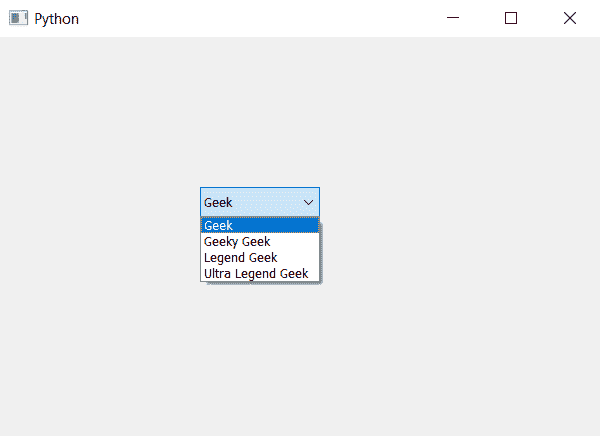

# PyQt5–如何在组合框中添加多个项目？

> 原文:[https://www . geeksforgeeks . org/pyqt 5-如何将多个项目添加到组合框/](https://www.geeksforgeeks.org/pyqt5-how-to-add-multiple-items-to-the-combobox/)

在本文中，我们将看到如何一次向组合框中添加多个项目。我们知道我们可以在 add item 方法的帮助下向组合框中添加项目，但是这种方法一次只添加一个项目。为了一次添加多个项目，我们必须使用 addItems 方法，该方法将一次添加所有项目，而不是逐个添加。

> **语法:**组合框. addItems(item_list)
> **参数:**它以列表为参数
> **执行的动作:**它会将所有列表项添加到组合框

下面是实现–

## 蟒蛇 3

```
# importing libraries
from PyQt5.QtWidgets import *
from PyQt5 import QtCore, QtGui
from PyQt5.QtGui import *
from PyQt5.QtCore import *
import sys

class Window(QMainWindow):

    def __init__(self):
        super().__init__()

        # setting title
        self.setWindowTitle("Python ")

        # setting geometry
        self.setGeometry(100, 100, 600, 400)

        # calling method
        self.UiComponents()

        # showing all the widgets
        self.show()

    # method for widgets
    def UiComponents(self):

        # creating a combo box widget
        combo_box = QComboBox(self)

        # setting geometry of combo box
        combo_box.setGeometry(200, 150, 120, 30)

        # geek list
        geek_list = ["Geek", "Geeky Geek", "Legend Geek", "Ultra Legend Geek"]

        # adding list of items to combo box
        combo_box.addItems(geek_list)

# create pyqt5 app
App = QApplication(sys.argv)

# create the instance of our Window
window = Window()

# start the app
sys.exit(App.exec())
```

**输出:**

