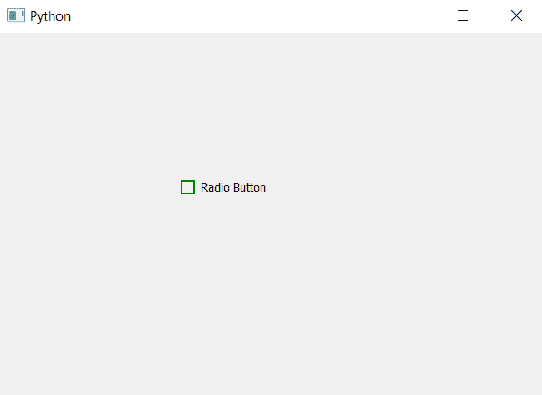

# pyqt 5–如何在单选按钮

中更改指示器边框

> 原文:[https://www . geesforgeks . org/pyqt 5-如何更改指示器-单选按钮中的边框/](https://www.geeksforgeeks.org/pyqt5-how-to-change-indicator-border-in-radio-button/)

在本文中，我们将看到如何更改单选按钮的边框。默认情况下，指示器是圆形的，并且有黑色边框，尽管我们可以更改边框的大小和颜色。

为了改变指示器的边框，我们必须改变与单选按钮相关联的指示器的样式表。下面是样式表代码。

```py
QRadioButton::indicator
{
border : 2px solid green;
}

```

**注意:**当我们改变指示器的样式表时，它的形状会从圆形变成方形。

下面是实现。

```py
# importing libraries
from PyQt5.QtWidgets import * 
from PyQt5 import QtCore, QtGui
from PyQt5.QtGui import * 
from PyQt5.QtCore import * 
import sys

class Window(QMainWindow):

    def __init__(self):
        super().__init__()

        # setting title
        self.setWindowTitle("Python ")

        # setting geometry
        self.setGeometry(100, 100, 600, 400)

        # calling method
        self.UiComponents()

        # showing all the widgets
        self.show()

    # method for widgets
    def UiComponents(self):

        # creating a radio button
        radio_button = QRadioButton(self)

        # setting geometry of radio button
        radio_button.setGeometry(200, 150, 120, 40)

        # setting text to radio button
        radio_button.setText("Radio Button")

        # setting style sheet associated with the radio button
        # adding border to the indicator
        radio_button.setStyleSheet("QRadioButton::indicator"
                                   "{"
                                   "border : 2px solid green"
                                   "}")

# create pyqt5 app
App = QApplication(sys.argv)

# create the instance of our Window
window = Window()

# start the app
sys.exit(App.exec())
```

**输出:**
