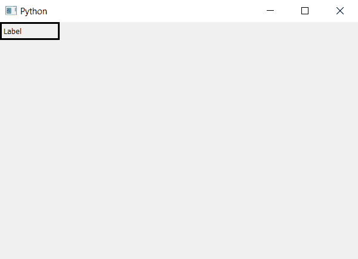

# pyqt 5–如何检查标签的可见性状态？

> 原文:[https://www . geesforgeks . org/pyqt 5-如何检查-可见性-标签状态/](https://www.geeksforgeeks.org/pyqt5-how-to-check-visibility-status-of-label/)

我们可以在 PyQt5 中使用`setVisible()`方法设置标签的可见性状态。为了检查任何标签的可见性状态，我们将使用`isVisible()`方法，这将通过检查标签是否可见来返回真或假。

**注意:**如果在构造函数中使用此方法，它将始终返回 False，因为一旦主窗口/父窗口可见，标签可见属性才会更改为 true。

> **语法:** label.isVisible()
> 
> **论证:**不需要论证。
> 
> **返回:**返回 bool。

**代码:**

```
# importing the required libraries

from PyQt5.QtCore import * 
from PyQt5.QtGui import * 
from PyQt5.QtWidgets import * 
import sys

class Window(QMainWindow):
    def __init__(self):
        super().__init__()

        # set the title
        self.setWindowTitle("Python")

        # setting geometry
        self.setGeometry(100, 100, 600, 400)
        # creating a label widget
        self.label_1 = QLabel("Label", self)

        # moving position
        self.label_1.move(0, 0)

        # setting up the border
        self.label_1.setStyleSheet("border :3px solid black;")

        # setting visibility status
        self.label_1.setVisible(True)

        # show all the widgets
        self.show()

# create pyqt5 app
App = QApplication(sys.argv)

# create the instance of our Window
window = Window()

# getting visibility status
visible = str(window.label_1.isVisible())

# printing visibility status of label
print(visible)

# start the app
sys.exit(App.exec())
```

**输出:**

```
True
```

