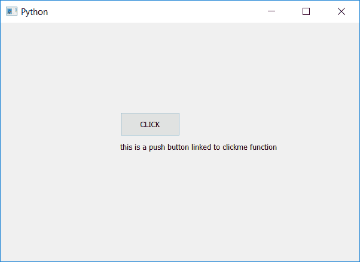

# PyQt5–如何创建和获取按钮的帮助文本？

> 原文:[https://www . geesforgeks . org/pyqt 5-如何创建和获取按钮帮助文本/](https://www.geeksforgeeks.org/pyqt5-how-to-create-and-get-the-help-text-of-push-button/)

PyQt5 为我们提供了为按钮设置帮助文本的功能，帮助文本是关于按钮的原始信息，即这个按钮执行什么功能，它如何与源代码链接等。在本文中，我们将看到如何创建和获取按钮的帮助文本。

为此，我们将使用`setWhatsThis`方法创建帮助文本，使用`whatsThis`方法获取帮助文本。

> **语法:**
> 
> ```py
> button.setWhatsThis(help_text)
> button.whatsThis()
> 
> ```
> 
> **论证:**
> `setWhatsThis`以弦为论证。
> `whatsThis`无需争论。
> 
> **返回:**
> 返回无。
> `whatsThis`返回字符串。

**代码:**

```py
# importing libraries
from PyQt5.QtWidgets import * 
from PyQt5.QtGui import * 
from PyQt5.QtCore import * 
import sys

class Window(QMainWindow):
    def __init__(self):
        super().__init__()

        # setting title
        self.setWindowTitle("Python ")

        # setting geometry
        self.setGeometry(100, 100, 600, 400)

        # calling method
        self.UiComponents()

        # showing all the widgets
        self.show()

    # method for widgets
    def UiComponents(self):

        # creating a push button
        button = QPushButton("CLICK", self)

        # setting geometry of button
        button.setGeometry(200, 150, 100, 40)

        # adding action to a button
        button.clicked.connect(self.clickme)

        # creating the help text
        button.setWhatsThis("this is a push button \
                          linked to clickme function")

        # getting the help text
        help = button.whatsThis()

        # creating label to print help text
        label = QLabel(help, self)
        label.adjustSize()
        label.move(200, 200)

    # action method
    def clickme(self):

        # printing pressed
        print("pressed")

# create pyqt5 app
App = QApplication(sys.argv)

# create the instance of our Window
window = Window()

# start the app
sys.exit(App.exec())
```

**输出:**
