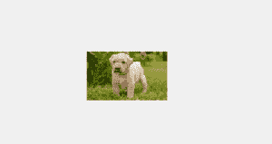
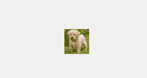
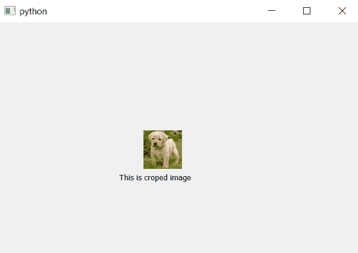

# pyqt 5–如何从矩形图像中获取裁剪后的正方形图像？

> 原文:[https://www . geeksforgeeks . org/pyqt 5-如何从矩形图像中裁剪出方形图像/](https://www.geeksforgeeks.org/pyqt5-how-to-get-cropped-square-image-from-rectangular-image/)

在这篇文章中，我们将看到如何显示从任何宽度和高度的矩形图像中裁剪出的正方形图像

 

> **为了做到这一点，我们必须执行以下步骤:**
> 
> 1.加载图像
> 2。裁剪图像使其成为正方形
> 3。使用画师
> 4 对其进行蒙版并制作出完美的正方形。将其转换回位图图像

**代码–**

下面这张原图的代码是:


```py
# importing libraries
from PyQt5.QtCore import * 
from PyQt5.QtGui import * 
from PyQt5.QtWidgets import *

# function to alter image
def mask_image(imgdata, imgtype ='png', size = 64):

    # Load image
    image = QImage.fromData(imgdata, imgtype)

    # convert image to 32-bit ARGB (adds an alpha 
    # channel ie transparency factor):
    image.convertToFormat(QImage.Format_ARGB32)

    # Crop image to a square:
    imgsize = min(image.width(), image.height())
    rect = QRect(
        (image.width() - imgsize) / 2,
        (image.height() - imgsize) / 2,
        imgsize,
        imgsize,
    )
    image = image.copy(rect)

    # Create the output image with the 
    # same dimensions and an alpha channel
    # and make it completely transparent:
    out_img = QImage(imgsize, imgsize, QImage.Format_ARGB32)
    out_img.fill(Qt.transparent)

    # Create a texture brush and paint a circle
    # with the original image onto
    # the output image:
    brush = QBrush(image)

    # Paint the output image
    painter = QPainter(out_img)
    painter.setBrush(brush)

    # Don't draw an outline
    painter.setPen(Qt.NoPen)

    # drawing square
    painter.drawRect(0, 0, imgsize, imgsize)

    # closing painter event
    painter.end()

    # Convert the image to a pixmap and rescale it.
    pr = QWindow().devicePixelRatio()
    pm = QPixmap.fromImage(out_img)
    pm.setDevicePixelRatio(pr)
    size *= pr
    pm = pm.scaled(size, size, Qt.KeepAspectRatio, 
                               Qt.SmoothTransformation)

    # return back the pixmap data
    return pm

class Window(QWidget):

    """Simple window that shows our masked image and text label."""
    def __init__(self):
        super().__init__()

        # setting up the geometry
        self.setGeometry(100, 100, 600, 400)

        # image path
        imgpath = "image.png"

        # loading image
        imgdata = open(imgpath, 'rb').read()

        # calling the function
        pixmap = mask_image(imgdata)

        # creating label
        self.ilabel = QLabel(self)

        # putting image on label
        self.ilabel.setPixmap(pixmap)

        # moving the label
        self.ilabel.move(240, 180)

        # another label to put text
        self.tlabel = QLabel('This is croped image', self)
        self.tlabel.move(200, 250)

# main function
if __name__ == '__main__':
    import sys
    from PyQt5.QtWidgets import QApplication

    # app created
    app = QApplication(sys.argv)
    w = Window()
    w.show()

    # begin the app
    sys.exit(app.exec_())
```

**输出:**
