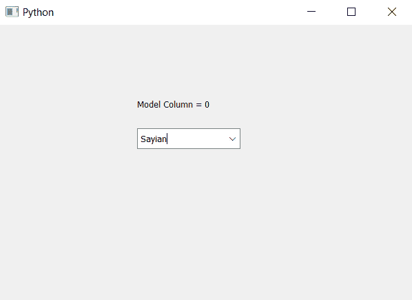

# PyQt5–如何在组合框

的模型中获得可见列

> 原文:[https://www . geesforgeks . org/pyqt 5-如何在组合框模型中获得可见列/](https://www.geeksforgeeks.org/pyqt5-how-to-get-visible-column-in-the-model-of-combo-box/)

在本文中，我们将看到如何获得组合框的可见列。列模型用于设置用户可见的列，model column 属性保存模型中可见的列。为了设置这个，我们使用`setModelColumn`方法。为了得到模型列，我们使用`modelColumn`方法。

> **语法:**组合框. modelColumn()
> 
> **论证:**不需要论证
> 
> **返回:**返回整数

以下是实施–

```
# importing libraries
from PyQt5.QtWidgets import * 
from PyQt5 import QtCore, QtGui
from PyQt5.QtGui import * 
from PyQt5.QtCore import * 
import sys

class Window(QMainWindow):

    def __init__(self):
        super().__init__()

        # setting title
        self.setWindowTitle("Python ")

        # setting geometry
        self.setGeometry(100, 100, 600, 400)

        # calling method
        self.UiComponents()

        # showing all the widgets
        self.show()

    # method for widgets
    def UiComponents(self):

        # creating a combo box widget
        self.combo_box = QComboBox(self)

        # setting geometry of combo box
        self.combo_box.setGeometry(200, 150, 150, 30)

        # setting visible model column
        self.combo_box.setModelColumn(0)

        # geek list
        geek_list = ["Sayian", "Super Saiyan", "Super Sayian 2", "Super Sayian B"]

        # making it editable
        self.combo_box.setEditable(True)

        # adding list of items to combo box
        self.combo_box.addItems(geek_list)

        # getting model column
        model_column = self.combo_box.modelColumn()

        # creating label to show model
        label = QLabel("Model Column = " + str(model_column), self)

        # setting geometry to the label
        label.setGeometry(200, 100, 300, 30)

# create pyqt5 app
App = QApplication(sys.argv)

# create the instance of our Window
window = Window()

# start the app
sys.exit(App.exec())
```

**输出:**
