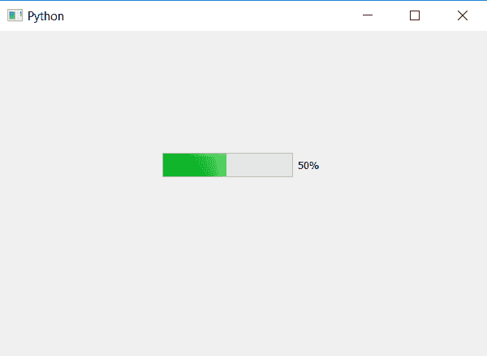

# PyQt5 |如何设置进度条的值？

> 原文:[https://www . geesforgeks . org/pyqt 5-如何设置进度条值/](https://www.geeksforgeeks.org/pyqt5-how-to-set-value-of-progress-bar/)

在本文中，我们将看到如何设置进度条的值。进度条基本上是一个用于可视化扩展计算机操作(如下载、文件传输或安装)进度的条。

为了给进度条设置值，我们将使用`setValue`方法。

> **语法:** bar.setValue(值)
> 
> **自变量:**它以整数为自变量，应该在 0 到 100 之间变化。
> 
> **执行的动作:**将进度条设置值。

**代码:**

```
# importing libraries
from PyQt5.QtWidgets import * 
from PyQt5.QtGui import * 
from PyQt5.QtCore import * 
import sys

class Window(QMainWindow):
    def __init__(self):
        super().__init__()

        # setting title
        self.setWindowTitle("Python ")

        # setting geometry
        self.setGeometry(100, 100, 600, 400)

        # calling method
        self.UiComponents()

        # showing all the widgets
        self.show()

    # method for widgets
    def UiComponents(self):

        # creating progress bar
        bar = QProgressBar(self)

        # setting geometry to progress bar
        bar.setGeometry(200, 150, 200, 30)

        # setting value to progress bar
        bar.setValue(50)

# create pyqt5 app
App = QApplication(sys.argv)

# create the instance of our Window
window = Window()

# start the app
sys.exit(App.exec())
```

**输出:**
