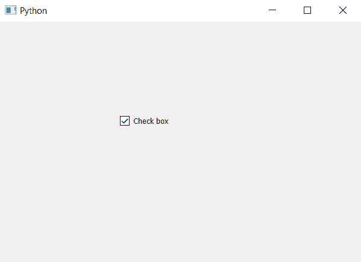

# PyQt5–复选框

的 isChecked()方法

> 原文:[https://www . geeksforgeeks . org/pyqt5-ischecked-method-for-check-box/](https://www.geeksforgeeks.org/pyqt5-ischecked-method-for-check-box/)

`isChecked`方法用于了解复选框是否被选中。如果选中复选框，此方法将返回 true，否则将返回 false。如果我们在创建复选框后使用此方法，它将始终返回 False，因为默认情况下复选框未被选中。

> **语法:**复选框. isChecked()
> 
> **论证:**不需要论证。
> 
> **返回:**返回 bool，是真还是假

下面是实现。

```py
# importing libraries
from PyQt5.QtWidgets import * 
from PyQt5 import QtCore, QtGui
from PyQt5.QtGui import * 
from PyQt5.QtCore import * 
import sys

class Window(QMainWindow):

    def __init__(self):
        super().__init__()

        # setting title
        self.setWindowTitle("Python ")

        # setting geometry
        self.setGeometry(100, 100, 600, 400)

        # calling method
        self.UiComponents()

        # showing all the widgets
        self.show()

    # method for widgets
    def UiComponents(self):

        # creating the check-box
        self.checkbox = QCheckBox('Check box', self)

        # setting geometry of check box
        self.checkbox.setGeometry(200, 150, 100, 30)

        # connecting it to function
        self.checkbox.stateChanged.connect(self.method)

        # checking if it checked
        check = self.checkbox.isChecked()

        # printing the check
        print(check)

    def method(self):

        # printing the checked status
        print(self.checkbox.isChecked())

# create pyqt5 app
App = QApplication(sys.argv)

# create the instance of our Window
window = Window()

# start the app
sys.exit(App.exec())
```

**输出:**

```py
False
True

```


当我们运行代码时，将打印假，并在选中复选框后打印真。