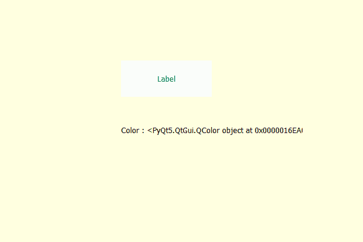

# PyQt5 标签–访问颜色效果的颜色

> 原文:[https://www . geesforgeks . org/pyqt 5-label-access-color-of-color-effect/](https://www.geeksforgeeks.org/pyqt5-label-accessing-color-of-the-color-effect/)

在本文中，我们将了解如何访问标签颜色效果的颜色。默认情况下，标签没有颜色效果，尽管我们可以为标签创建颜色效果。色彩效果不像背景色，它更像是我们在图片上使用的彩色滤镜。

> **语法:** color_effect.color()
> 这里 color_effect 是 QGraphicsColorizeEffect 对象
> 
> **论证:**不需要论证
> 
> **返回:**返回 QColor 对象

下面是实现

```py
# importing libraries
from PyQt5.QtWidgets import * 
from PyQt5 import QtCore, QtGui
from PyQt5.QtGui import * 
from PyQt5.QtCore import * 
import sys

class Window(QMainWindow):

    def __init__(self):
        super().__init__()

        # making background color light yellow
        self.setStyleSheet("background : lightyellow;")

        # setting title
        self.setWindowTitle("Python ")

        # setting geometry
        self.setGeometry(100, 100, 600, 400)

        # calling method
        self.UiComponents()

        # showing all the widgets
        self.show()

    # method for widgets
    def UiComponents(self):

        # creating label
        label = QLabel("Label", self)

        # setting geometry to the label
        label.setGeometry(200, 100, 150, 60)

        # setting alignment to the label
        label.setAlignment(Qt.AlignCenter)

        # creating a color effect
        color_effect = QGraphicsColorizeEffect()

        # setting color to color effect
        color_effect.setColor(Qt.darkGreen)

        # adding color effect to the label
        label.setGraphicsEffect(color_effect)

        # creating result label
        result = QLabel(self)

        # setting geometry to the result
        result.setGeometry(200, 200, 300, 30)

        # getting the color
        color = color_effect.color()

        # setting text to result label
        result.setText("Color : " + str(color))

# create pyqt5 app
App = QApplication(sys.argv)

# create the instance of our Window
window = Window()

# start the app
sys.exit(App.exec())
```

**语法:**
