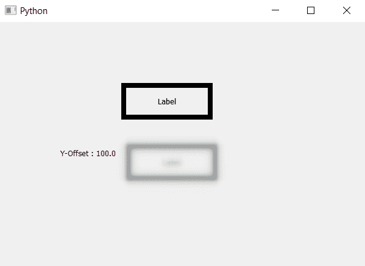

# PyQt5 标签–访问阴影的垂直偏移

> 原文:[https://www . geesforgeks . org/pyqt 5-标签-访问-垂直-阴影偏移/](https://www.geeksforgeeks.org/pyqt5-label-accessing-vertical-offset-of-shadow/)

在本文中，我们将看到如何访问标签阴影的垂直偏移，偏移基本上是标签阴影和标签之间的距离默认偏移值为 8，尽管我们可以随时更改它。

> 为了做到这一点，我们使用`yOffset`方法
> 
> **语法:** shadow.yOffset()
> 这里的 shadow 是 QGraphicsDropShadowEffect 对象
> 
> **论证:**不需要论证
> 
> **返回:**返回浮点值

下面是实现

```
# importing libraries
from PyQt5.QtWidgets import * 
from PyQt5 import QtCore, QtGui
from PyQt5.QtGui import * 
from PyQt5.QtCore import *
import sys

class Window(QMainWindow):

    def __init__(self):
        super().__init__()

        # setting background color of window
        # self.setStyleSheet("background-color : black;")

        # setting title
        self.setWindowTitle("Python ")

        # setting geometry
        self.setGeometry(100, 100, 600, 400)

        # calling method
        self.UiComponents()

        # showing all the widgets
        self.show()

    # method for widgets
    def UiComponents(self):

        # creating label
        label = QLabel("Label", self)

        # setting alignment
        label.setAlignment(Qt.AlignCenter)

        # setting geometry to the label
        label.setGeometry(200, 100, 150, 60)

        # setting border
        label.setStyleSheet("border : 8px solid black")

        # creating a QGraphicsDropShadowEffect object
        shadow = QGraphicsDropShadowEffect()

        # setting blur radius
        shadow.setBlurRadius(20)

        # setting Yoffset
        shadow.setYOffset(100)

        # adding shadow to the label
        label.setGraphicsEffect(shadow)

        # creating label
        result = QLabel(self)

        # setting geometry
        result.setGeometry(100, 200, 350, 30)

        # getting shadow Y-offset
        Yoffset = shadow.yOffset()

        # showing text through label
        result.setText("Y-Offset : " + str(Yoffset))

# create pyqt5 app
App = QApplication(sys.argv)

# create the instance of our Window
window = Window()

# start the app
sys.exit(App.exec())
```

**输出:**
