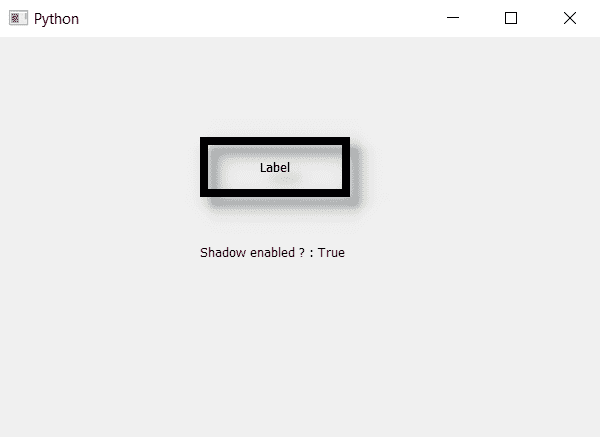

# PyQt5 标签–检查阴影是否启用

> 原文:[https://www . geesforgeks . org/pyqt 5-标签检查-是否启用阴影/](https://www.geeksforgeeks.org/pyqt5-label-checking-if-shadow-is-enabled-or-not/)

在本文中，我们将了解如何检查标签阴影是否启用。借助`setEnabled`方法可以启用或禁用阴影。

> 为了做到这一点，我们使用`isEnabled`方法
> 
> **语法:** shadow.isEnabled()
> 
> **论证:**不需要论证
> 
> **返回:**返回 bool

下面是实现

```
# importing libraries
from PyQt5.QtWidgets import * 
from PyQt5 import QtCore, QtGui
from PyQt5.QtGui import * 
from PyQt5.QtCore import * 
import sys

class Window(QMainWindow):

    def __init__(self):
        super().__init__()

        # setting title
        self.setWindowTitle("Python ")

        # setting geometry
        self.setGeometry(100, 100, 600, 400)

        # calling method
        self.UiComponents()

        # showing all the widgets
        self.show()

    # method for widgets
    def UiComponents(self):

        # creating label
        label = QLabel("Label", self)

        # setting alignment
        label.setAlignment(Qt.AlignCenter)

        # setting geometry to the label
        label.setGeometry(200, 100, 150, 60)

        # setting border
        label.setStyleSheet("border : 8px solid black")

        # creating a QGraphicsDropShadowEffect object
        self.shadow = QGraphicsDropShadowEffect()

        # setting blur radius
        self.shadow.setBlurRadius(30)

        # setting Xoffset
        self.shadow.setOffset(10)

        # adding shadow to the label
        label.setGraphicsEffect(self.shadow)

        # checking if shadow is enabled or not
        check = self.shadow.isEnabled()

        # making label
        result = QLabel(self)

        # setting geometry
        result.setGeometry(200, 200, 300, 30)

        # setting text
        result.setText("Shadow enabled ? : " + str(check))

# create pyqt5 app
App = QApplication(sys.argv)

# create the instance of our Window
window = Window()

# start the app
sys.exit(App.exec())
```

**输出:**
