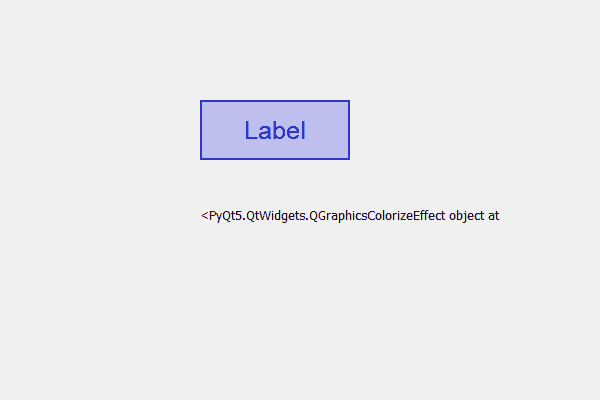

# PyQt5 标签–获取颜色效果对象

> 原文:[https://www . geesforgeks . org/pyqt 5-label-get-color-effect-object/](https://www.geeksforgeeks.org/pyqt5-label-getting-color-effect-object/)

在这篇文章中，我们将看到如何获得标签的颜色效果对象默认情况下，标签没有颜色效果，尽管我们可以创建颜色效果，然后借助`setGraphicsEffect`方法将其添加到标签中。

> 为此，我们必须执行以下操作–
> 
> 1.创建标签
> 2。将几何图形设置为标签
> 3。创建一个 QGraphicsColorizeEffect 对象
> 4。借助 setGraphicsEffect 方法
> 5 将该对象添加到标签中。借助 graphicsEffect 方法获取不透明度对象

**注意:**该对象与原对象具有相同的属性

**语法:**

```
# creating a color effect
color_effect = QGraphicsColorizeEffect()

# adding color effect to the label
label.setGraphicsEffect(color_effect)

# getting the color object
object = label.graphicsEffect()

```

下面是实现

```
# importing libraries
from PyQt5.QtWidgets import * 
from PyQt5 import QtCore, QtGui
from PyQt5.QtGui import * 
from PyQt5.QtCore import * 
import sys

class Window(QMainWindow):

    def __init__(self):
        super().__init__()

        # setting title
        self.setWindowTitle("Python ")

        # setting geometry
        self.setGeometry(100, 100, 600, 400)

        # calling method
        self.UiComponents()

        # showing all the widgets
        self.show()

    # method for widgets
    def UiComponents(self):

        # creating label
        label = QLabel("Label", self)

        # setting geometry to the label
        label.setGeometry(200, 100, 150, 60)

        # setting alignment to the label
        label.setAlignment(Qt.AlignCenter)

        # setting font
        label.setFont(QFont('Arial', 15))

        # setting style sheet of the label
        label.setStyleSheet("QLabel"
                            "{"
                            "border : 2px solid green;"
                            "background : lightgreen;"
                            "}")

        # creating a color effect
        self.color_effect = QGraphicsColorizeEffect()

        # adding color effect to the label
        label.setGraphicsEffect(self.color_effect)

        # result label
        result = QLabel(self)

        # setting geometry of the result label
        result.setGeometry(200, 200, 300, 30)

        # getting the color object
        object = label.graphicsEffect()

        # setting text to the result label
        result.setText(str(object))

# create pyqt5 app
App = QApplication(sys.argv)

# create the instance of our Window
window = Window()

# start the app
sys.exit(App.exec())
```

**输出:**
