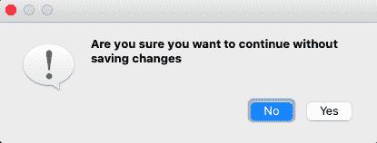
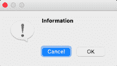
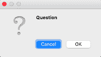
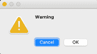
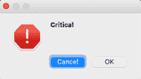

# pyqt 5–消息框

> 哎哎哎:# t0]https://www . geeksforgeeks . org/pyqt 5-message box/

在本文中，我们将讨论 PyQT5 模块的消息框小部件。它用于显示消息框。 **PyQt5** 是一个使用 Qt GUI 框架创建 GUI 的库。Qt 最初是用 C++编写的，但可以在 Python 中使用。可以使用以下命令安装最新版本的 PyQt5:

```py
pip install PyQt5
```

## 什么是消息框？

消息框通常用于向用户声明一小段信息。它为用户提供了一个不能错过的弹出框，以避免用户错过重要的错误和信息，在某些情况下，用户在不确认消息框的情况下无法继续。



基于应用程序，有四种类型的消息框。以下是创建消息框的语法。对于任何一个盒子，都需要进行实例化。

**语法:**

```py
msg_box_name = QMessageBox() 
```

现在根据需求创建一个合适的消息框。

## 消息框的类型

### 信息消息框

当相关信息需要传递给用户时，使用这种类型的消息框。

**语法:**

> msg _ box _ name . seticon(QMessageBox。信息)



### 问题消息框

此消息框用于从用户处获得关于要执行的某些活动或动作的答案。

**语法:**

> msg _ box _ name . setcon(qmmessage box)。(问题)



### 警告消息框

这将触发关于用户将要执行的操作的警告。

**语法:**

> msg _ box _ name . seticon(QMessageBox。警告)



### 关键消息框

这通常用于获取用户对关键操作的意见。

**语法:**

> msg _ box _ name . seticon(QMessageBox。关键)



## 使用 PyQt5 创建一个简单的消息框

现在要创建一个生成消息框的程序，首先要导入所有需要的模块，并创建一个带有四个按钮的小部件，单击其中任何一个按钮都会生成一个消息框。

现在，为每个按钮关联一个消息框，当单击相应的按钮时弹出。首先，实例化一个消息框并添加一个必需的图标。现在为将要生成的 pop 设置适当的属性。另外，添加按钮来处理标准机制。

下面给出了完整的实现。

**程序:**

## 计算机编程语言

```py
#import libraries
import sys
from PyQt5.QtWidgets import *

def window():
        # create pyqt5 app
    app = QApplication(sys.argv)
    w = QWidget()

    # create buttons

    # b1- Information button
    b1 = QPushButton(w)
    b1.setText("Information")
    b1.move(45, 50)

    # b2- Warning button
    b2 = QPushButton(w)
    b2.setText("Warning")
    b2.move(150, 50)

    # b3- Question button
    b3 = QPushButton(w)
    b3.setText("Question")
    b3.move(50, 150)

    # b4- Critical button
    b4 = QPushButton(w)
    b4.setText("Critical")
    b4.move(150, 150)

    # declaring command when button clicked
    b1.clicked.connect(show_info_messagebox)
    b2.clicked.connect(show_warning_messagebox)
    b3.clicked.connect(show_question_messagebox)
    b4.clicked.connect(show_critical_messagebox)

    # setting title of the window
    w.setWindowTitle("PyQt MessageBox")

    # showing all the widgets
    w.show()

    # start the app
    sys.exit(app.exec_())

def show_info_messagebox():
    msg = QMessageBox()
    msg.setIcon(QMessageBox.Information)

    # setting message for Message Box
    msg.setText("Information ")

    # setting Message box window title
    msg.setWindowTitle("Information MessageBox")

    # declaring buttons on Message Box
    msg.setStandardButtons(QMessageBox.Ok | QMessageBox.Cancel)

    # start the app
    retval = msg.exec_()

def show_warning_messagebox():
    msg = QMessageBox()
    msg.setIcon(QMessageBox.Warning)

    # setting message for Message Box
    msg.setText("Warning")

    # setting Message box window title
    msg.setWindowTitle("Warning MessageBox")

    # declaring buttons on Message Box
    msg.setStandardButtons(QMessageBox.Ok | QMessageBox.Cancel)

    # start the app
    retval = msg.exec_()

def show_question_messagebox():
    msg = QMessageBox()
    msg.setIcon(QMessageBox.Question)

    # setting message for Message Box
    msg.setText("Question")

    # setting Message box window title
    msg.setWindowTitle("Question MessageBox")

    # declaring buttons on Message Box
    msg.setStandardButtons(QMessageBox.Ok | QMessageBox.Cancel)

    # start the app
    retval = msg.exec_()

def show_critical_messagebox():
    msg = QMessageBox()
    msg.setIcon(QMessageBox.Critical)

    # setting message for Message Box
    msg.setText("Critical")

    # setting Message box window title
    msg.setWindowTitle("Critical MessageBox")

    # declaring buttons on Message Box
    msg.setStandardButtons(QMessageBox.Ok | QMessageBox.Cancel)

    # start the app
    retval = msg.exec_()

if __name__ == '__main__':
    window()
```

**输出**

