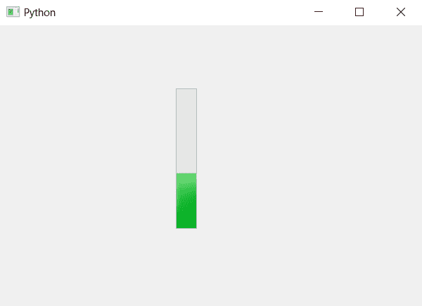

# PyQt5–方向()方法进度条

> 原文:[https://www . geesforgeks . org/pyqt 5-方向-方法-进度条/](https://www.geeksforgeeks.org/pyqt5-orientation-method-progress-bar/)

当我们在 PyQt5 中创建进度条时，它的方向默认是水平的，但是我们可以借助`setOrientation`方法来更改它。为了获得进度条方向的信息，即进度条是水平的还是垂直的`orientation`方法被使用。

> **语法:** bar.orientation()
> 
> **论证:**不需要论证。
> 
> **返回:**它会返回 Orientation 对象，虽然我们打印时，它会打印 1 表示水平方向，2 表示垂直方向。

下面是实现。

```py
# importing libraries
from PyQt5.QtWidgets import * 
from PyQt5 import QtCore, QtGui
from PyQt5.QtGui import * 
from PyQt5.QtCore import * 
import sys

class Window(QMainWindow):

    def __init__(self):
        super().__init__()

        # setting title
        self.setWindowTitle("Python ")

        # setting geometry
        self.setGeometry(100, 100, 600, 400)

        # calling method
        self.UiComponents()

        # showing all the widgets
        self.show()

    # method for widgets
    def UiComponents(self):
        # creating progress bar
        bar = QProgressBar(self)

        # setting geometry to progress bar
        bar.setGeometry(250, 90, 30, 200)

        # set value to progress bar
        bar.setValue(40)

        # setting alignment to center
        bar.setAlignment(Qt.AlignCenter)

        # setting orientation to vertical
        bar.setOrientation(QtCore.Qt.Vertical)

        # getting orientation
        orientation = bar.orientation()

        # printing its type
        print(type(orientation))

        # printing the orientation
        print(orientation)

# create pyqt5 app
App = QApplication(sys.argv)

# create the instance of our Window
window = Window()

# start the app
sys.exit(App.exec())
```

**输出:**

```py
class 'PyQt5.QtCore.Qt.Orientation'
2

```

